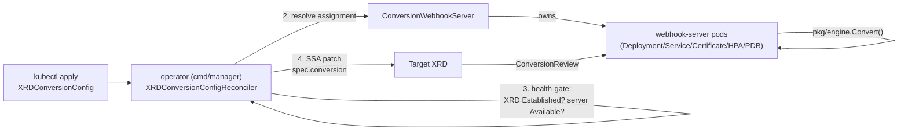

# Architecture

## Three CRDs, two webhook surfaces — don't conflate them

There are two entirely separate admission-webhook surfaces in this project, and they're easy to mix up:

1. **This operator's own admission webhook.** Validates `XRDConversionConfig`, `CRDConversionConfig`, and `ConversionWebhookServer` objects themselves at `kubectl apply` time (e.g. rejecting a config with an unacknowledged lossy rule, or a second `ConversionWebhookServer` marked `default`). Served by the `manager` binary. Completely standard kubebuilder scaffolding, since these three CRDs are themselves single-version. The same surface also serves the [XRD conversion guard](#the-xrd-conversion-guard) — a mutating webhook on Crossplane's own XRDs, sharing the same certificate and Service.
2. **The CRD conversion webhook.** Served per-target-resource by `ConversionWebhookServer` instances (the `webhook-server` binary), dynamically wired onto each target XRD or native CRD at runtime by the corresponding controller. This is the thing that actually converts your composite resources or custom resources between versions.

## End-to-end flow



The controller never patches the XRD until *all* of validation, XRD health, and webhook-server health pass — and, when the patch would move the target to a different instance, until that instance reports it can already serve it. See [XRDConversionConfig: ordering](configuration/xrdconversionconfig.md#ordering-nothing-touches-the-xrd-until-every-gate-passes) for the exact gate sequence and [Moving a target between instances](#moving-a-target-between-instances) for the last one.

## The XRD conversion guard

An XRD shipped inside a Crossplane `Configuration` package **loses its conversion webhook on a recurring basis**, and the operator's re-apply is a race it usually — but not always — wins.

**The mechanism.** Crossplane's package establisher ends in a full `client.Update` from the package contents, under an upstream comment reading `// This should be a server side apply?`. Its `merge` step preserves nothing for XRDs. A `client.Update` is a *replace*: it is not merge-aware and it ignores Server-Side Apply field ownership, so `spec.conversion` and this operator's two annotations are removed outright. `Establish` runs on **every** revision reconcile, with no diff check and no early return for a healthy revision — and the manager's `SyncPeriod` is Crossplane's `--sync` flag, which defaults to **one hour**. A `Lock` change (any package installed, upgraded or removed anywhere on the cluster) or a Crossplane restart does the same thing off-schedule.

**Why it matters more than it sounds.** With `spec.conversion` gone, Crossplane re-renders the generated CRD without it and the CRD falls back to `strategy: None`. The apiserver then serves a stored object at a different version by **relabelling `apiVersion` and returning the original field layout**. Clients get wrong data with HTTP 200, and writes during the window persist the wrong shape. Nothing errors. The operator watches XRDs, so it re-applies within seconds — the exposure is a race of seconds, roughly hourly, per package-managed XRD. That is small, and it is exactly the profile of a bug nobody can reproduce.

**Why patching the generated CRD instead does not work.** The instinct is to patch the CRD rather than the XRD, on the theory that Crossplane only owns the XRD. Crossplane's definition controller applies the rendered CRD through `resource.NewAPIUpdatingApplicator` (itself under a `TODO(negz): Use server-side apply instead`), whose `Apply` is a `Get` followed by a full `client.Update` — on a controller that reconciles on *every* XRD change rather than hourly. Both write paths are non-SSA full replaces. There is no object in the chain where field ownership survives.

**So the guard corrects the write instead.** A **mutating admission webhook on `compositeresourcedefinitions`** (CREATE and UPDATE) re-injects `spec.conversion` and the two annotations into any write whose result would drop them. The field is restored inside the same request, so there is no interval during which the generated CRD lacks conversion — compare the un-guarded behaviour, where correctness depends on winning a race after the fact. Nothing outside this operator changes: the Configuration package, the `ConfigurationRevision`, and Crossplane itself are untouched, the establisher's `Update` succeeds, and it never re-reads the object to compare.

The decisions that make it safe to run in front of every XRD write on the cluster:

- **`failurePolicy: Ignore`, not configurable.** A guard that can block XRD writes would make package installs depend on this operator's availability — unacceptable for something meant to be purely additive. Fail open, with the controller's re-apply as the backstop: normal operation has no window, degraded operation is exactly the behaviour without the guard.
- **Scoped by the field index, not by an `objectSelector`.** The tempting selector — a label the operator sets — is self-defeating: that label is wiped by the very `Update` being guarded against, so it would switch the guard off in exactly the case it exists for. The guard matches every XRD write and returns early on a miss against the existing XRD-name field index. XRDs are few and rarely written, and the handler is an in-memory lookup with no API call.
- **Only ever adds.** Nothing but `spec.conversion` and the two annotations is read, compared, or written, so a package's own changes to every other field go through as written.
- **Never hijacks somebody else's webhook.** An incoming `spec.conversion` pointing at a webhook this operator does not manage — identified by the `conversion.terasky.com/managed-by` annotation — is left completely alone.
- **Only restores what the controller already applied.** The config has to be in the state that earned an apply: `Applied=True`, `status.lastAppliedPlanHash` set, coordinates resolved, not being deleted. Injecting for a config that has not passed its own gates would route live admission traffic at a webhook server the operator has never confirmed is serving it.
- **No fight loop.** The package manager's `Update` succeeds and it never re-reads to compare, and the `ConfigurationRevision` controller does not watch the objects it establishes — it watches only `ConfigurationRevision`, `Lock` and `ImageConfig`.

**It is a bridge, not a fixture.** Both upstream write paths carry a TODO to move to Server-Side Apply. The day either one does, this operator's SSA field ownership holds on its own and the guard becomes a no-op. It is behind `--enable-xrd-conversion-guard` (chart: `features.crossplane.conversionGuard.enabled`, default on) so it can be retired without a code change; disabling it restores exactly the pre-guard behaviour.

Whether or not the guard is enabled, the `PackageManaged` condition and the `dco_manager_conversion_reverts_total` metric make the hazard visible — see [Observability](observability.md).

## `pkg/engine`: the reusable, Crossplane-agnostic core

Every place that actually performs a conversion — the controller's validation, the webhook server's hot path, and the `convctl` CLI — goes through the same `pkg/engine` package. It's deliberately kept agnostic of Crossplane: it depends only on standard Kubernetes `apiextensions.JSONSchemaProps` and a small `SchemaSource` interface.

```go
type SchemaSource interface {
    Versions() ([]VersionSchema, error) // Name, Schema, Served, Storage (= hub/referenceable)
    Describe() ResourceDescriptor
}
```

`pkg/xrdadapter` is the package that knows Crossplane XRDs exist — it implements `SchemaSource` by reading an XRD's `spec.versions[]`. `pkg/crdadapter` is its sibling for plain native `CustomResourceDefinition`s, reading `spec.versions[].{name,served,storage,schema}` directly (CRDs already use the exact vendored Go types this package needs, so no unstructured conversion is required the way it is for Crossplane). Neither adapter changes anything about `pkg/engine` itself — that's the point of the seam.

**Two entry points, both operating on a precompiled `Plan`:**

- `Compile(rules, hubSchema, spokeSchema) (*Plan, []Diagnostic, error)` — flattens both schemas to leaf paths, resolves every rule's declared path(s) against them, computes per-rule, per-direction losslessness, and fails the whole compile if any hub or spoke leaf path is left unclaimed and isn't structurally identical on both sides. A `Plan` only ever comes out of a successful compile with zero errors.
- `Convert(plan, direction, object) (map[string]any, error)` — the hot path. Every `Op` reads from the pristine input tree and writes into a fresh output tree, so ops can never observe each other's partial output and rule ordering can never matter. Two rules writing the same terminal path is a compile-time error, not a runtime race.

Routing is always **hub-and-spoke**: a spoke-to-spoke conversion request is served as two `Convert` calls chained through the hub, the same pattern controller-runtime's `Hub`/`Convertible` interfaces use for native CRD conversion. This keeps compilation O(N) for N spoke versions rather than O(N²).

## The webhook server runtime

Each `ConversionWebhookServer` replica is symmetric and self-sufficient — there is no leader election, because there's no shared state to coordinate:

- Every replica runs its own lightweight controller-runtime manager, watching `XRDConversionConfig`, `ConversionWebhookServer`, and the relevant XRDs directly. No push mechanism from the main operator.
- On a config assigned to it (via the same shared resolver the operator uses), it compiles a `Plan` and atomically swaps it into an in-memory registry — `atomic.Pointer` to a copy-on-write map, giving lock-free reads on the admission-critical hot path.
- A single config's compile failure is **non-fatal**: the pod keeps serving whatever was last good for that XRD, recording the failure only in metrics and `/debug/registry` — it never crash-loops or de-readies the whole pod over one bad config.
- **Readiness** gates on both informer cache sync *and* a completed first reconcile pass over every currently-existing config, closing the classic "added to Service endpoints before the registry is populated" gap.
- A registry miss (a `ConversionReview` for an XRD this replica has no compiled plan for) fails closed with a clear `503`, rather than guessing.
- A replica holds a compiled plan while **either** the shared resolver assigns the target to its instance **or** the live target's `spec.conversion` still names its Service. The second clause is what makes a handover safe from the losing side — see below.

## Moving a target between instances

Assignment is not static. `spec.webhookServerRef` can be edited, and
[automatic sharding](configuration/conversionwebhookserver.md#automatic-sharding)
rebalances unpinned configs when an instance is added or removed. Each of
those means repointing a target's `spec.conversion` at a different Service,
and that is the one operation in this design with a genuine race: the
apiserver starts calling the new Service the moment the write lands, and a
replica that has not compiled the plan yet answers `503`. Every read and
write of that resource fails until it has — an outage produced by a
scaling decision, on resources that had nothing to do with it.

The window is closed from both ends, and neither end requires the operator
to call a pod:

```
assignment changes  ──▶  destination replicas compile the plan
                              │  (they watch the same objects the operator does)
                              ▼
                         each publishes its servable target set into its own Lease
                              │
                              ▼
   operator reads those, waits until EVERY live replica reports the target
                              │
                              ▼
                    operator patches spec.conversion → destination
                              │
                              ▼
      source replicas see the target stop naming them, and start a 30s drain
                              │
                              ▼
                         only then do they drop the plan
```

Until that patch lands the target still names the **source**, and the
source is still serving it — because a replica keeps a plan for as long as
the live target points at it, not merely for as long as it is assigned.
That is what makes "wait" safe rather than merely slower: at no point is
the target unserved.

**The drain closes the other end of the same window.** The apiserver
refreshes a CRD's conversion configuration *asynchronously* after the write
that changed it, so for a moment after the repoint it is still calling the
source's Service. A replica that dropped its plan the instant the object
changed would answer those calls with a 503 — reported as a failed read or
write on a resource that was only being rebalanced. It is the same shape of
race as the `preStop` sleep one layer down, and it gets the same treatment:
wait out the propagation rather than try to observe it.

That was not theory. Before the drain existed, `hack/e2e-reassign.sh`
caught exactly one failed write in 9,456 across three reassignments, with
the registry-miss message. One in ten thousand is small, and it is not
zero.

The config's `HandoverReady` condition reports where in that sequence a
move is. `hack/e2e-reassign.sh` drives three reassignments under sustained
reads and writes and asserts zero failures and zero wrong values.

**Why a Lease.** The operator's reconcile loop deliberately makes no
network calls to webhook-server pods, so per-replica state has to be
published rather than queried. A Lease is owned by its Pod, so it is
collected with it; `renewTime` is a first-class staleness signal for a pod
that is alive but wedged; and it is a small dedicated object, so a
thirty-second heartbeat is not rewriting something other controllers watch.
The aggregate lands on `ConversionWebhookServer.status.servedTargets`.

## One cluster, one install

Every operator replica and every `ConversionWebhookServer` replica is
self-sufficient **inside a single Kubernetes cluster**. There is no leader
election on the webhook-server path, no shared conversion state, and no
network hop to another cluster on a `ConversionReview`. That is a design
constraint, not a current gap.

**Cross-cluster webhook failover is out of scope.** A webhook-server in
cluster A must not serve conversions for a resource whose apiserver lives
in cluster B. Each cluster runs its own fully independent install
(chart + `ConversionWebhookServer` + configs). Fleet consistency is a
**CI problem**, not an operator feature: run the same config through
[`convctl test --live`](cli.md#pre-upgrade-checks-testing-against-everything-that-already-exists)
and [`convctl diff --live`](cli.md#convctl-diff) against every kubecontext
before merge — see [Fleet CI](gitops/fleet-ci.md).

Asking the operator to fail over conversion state across clusters would
need a redesign (shared registry, cross-cluster identity, a different
availability model). Until that exists, do not point `spec.conversion`
at a Service in another cluster.

## Safety by construction: the hazards this design closes

| Scenario | Mitigation |
|---|---|
| Config deleted while the XRD still has >1 served version | Finalizer blocks deletion unless ≤1 served version remains, or the explicit unsafe-delete annotation is present. See [Config delete race window](#config-delete-race-window) for the precise ordering and residual windows. |
| `ConversionWebhookServer` deleted while configs still reference it (including as `default`) | Finalizer blocks **deletion** unless zero configs resolve to it, or the explicit force-delete annotation is present. Scaling replicas to zero is not blocked by the finalizer — readiness/availability gates on configs surface that separately. |
| A config update makes a previously-lossless conversion lossy | Full re-validation happens before any XRD patch; a regression sets `Invalid` and the old plan keeps running unpatched. |
| The XRD's schema drifts after a config was `Applied` | Re-validated every reconcile. A clean drift self-heals silently; a failing one goes loudly `Stale` but keeps serving the last known-good plan by default (`driftPolicy: KeepServingStale`). |
| Two configs target the same XRD/CRD name | Blocked by admission webhook uniqueness across both XRDConversionConfig and CRDConversionConfig — registry keys are the bare target name, so cross-kind collisions are rejected too. |
| `ConversionWebhookServer` change enqueues many configs | Only configs currently assigned to that server are enqueued, paced at 50 QPS (`internal/enqueue.CWSConfigEnqueueQPS`) so a 200-config fan-out spreads over ~4s instead of an unbounded workqueue burst. |
| The cert-manager `Certificate` rotates | The controller watches the Secret directly and refreshes `caBundle` on the XRD — cert-manager's CA injector doesn't support `CompositeResourceDefinition` as an injection target. |

## Config delete race window

Both `XRDConversionConfig` and `CRDConversionConfig` use a finalizer
(`conversion.terasky.com/safe-revert` / `.../safe-revert-crd`) so deletion
is not instantaneous. The delete reconcile does the following, in order:

1. **No finalizer** → nothing to do (object already releasing).
2. **Phase is neither `Applied` nor `Stale`** → remove the finalizer
   immediately (never applied, or already torn down). **No target revert.**
3. **Target XRD/CRD is gone** → remove the finalizer (nothing to revert).
4. **Target still serves >1 version** and the live object does **not** carry
   `conversion.terasky.com/allow-unsafe-delete=true` → set
   `DeletionBlocked`, keep the finalizer, requeue in 30s.
5. **Otherwise** → **revert first** (`spec.conversion.strategy=None` via
   SSA), **then** remove the finalizer.

So the common “finalizer removed while the target still has webhook
conversion” race the roadmap flagged is **not** the successful-path
ordering: revert completes before the finalizer drops. The residual
windows are narrower:

| Window | What can happen | Mitigation / why accepted |
|---|---|---|
| Crash after target SSA patch but **before** status reaches `Phase=Applied` | A subsequent delete sees a non-Applied/non-Stale phase and removes the finalizer **without** reverting, leaving webhook conversion on the target | Narrow crash window; restart without delete re-applies idempotently and persists `Applied` (covered by Phase 2.1 failure tests). Operators deleting in that exact window should clear conversion manually or re-create a config. |
| Crash after successful revert but before finalizer removal | Finalizer remains; next delete reconcile reverts again (idempotent) then removes the finalizer | Self-heals on retry. |
| After finalizer removal, webhook-server replicas still hold a compiled plan until their watch fires | In-memory plan may exist briefly while the apiserver already has `strategy: None` | Harmless: the apiserver will not call the conversion webhook once strategy is `None`. |
| Break-glass annotation | Checked **live** on the delete reconcile only — must be present on the object being deleted right now | Documented on the config pages; not a sticky historical flag. |

### Evaluation: is an admission-time DELETE guard warranted?

An admission webhook that refused DELETE while the live target still had
this operator’s webhook conversion would close the apply-before-status
crash window above. It would not replace the multi-served-version
finalizer (admission cannot hold an object open across a long-running
revert the way a finalizer can).

**Conclusion:** the current finalizer model is sufficient. The residual
window is crash-only and already has restart recovery coverage; adding
DELETE admission would add complexity for little operational gain. No
follow-up hardening issue is filed from this writeup.

## Repository layout

```text
api/v1alpha1/            XRDConversionConfig, CRDConversionConfig, ConversionWebhookServer CRD types
pkg/engine/               CRD-agnostic conversion engine: analyze, compile, convert
pkg/xrdadapter/           Crossplane XRD -> engine.SchemaSource adapter
pkg/crdadapter/           native CustomResourceDefinition -> engine.SchemaSource adapter
internal/assign/          shared "which ConversionWebhookServer serves this config" resolver
internal/controller/      the two reconcilers
internal/webhook/         this operator's own admission webhooks
internal/webhookserver/   the conversion webhook runtime (registry, HTTP handlers, metrics)
internal/cli/             convctl command implementations
cmd/manager/              operator binary
cmd/webhook-server/       conversion webhook runtime binary
cmd/convctl/              CLI binary
config/                   kustomize manifests (kubebuilder dev-loop / CI)
charts/declarative-conversion-operator/  Helm chart (the supported install path)
```
