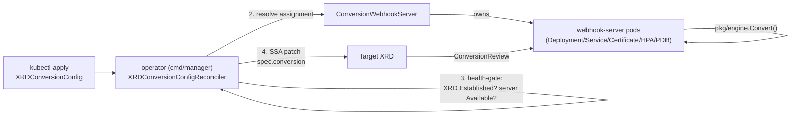

# Architecture

## Three CRDs, two webhook surfaces — don't conflate them

There are two entirely separate admission-webhook surfaces in this project, and they're easy to mix up:

1. **This operator's own admission webhook.** Validates `XRDConversionConfig`, `CRDConversionConfig`, and `ConversionWebhookServer` objects themselves at `kubectl apply` time (e.g. rejecting a config with an unacknowledged lossy rule, or a second `ConversionWebhookServer` marked `default`). Served by the `manager` binary. Completely standard kubebuilder scaffolding, since these three CRDs are themselves single-version.
2. **The CRD conversion webhook.** Served per-target-resource by `ConversionWebhookServer` instances (the `webhook-server` binary), dynamically wired onto each target XRD or native CRD at runtime by the corresponding controller. This is the thing that actually converts your composite resources or custom resources between versions.

## End-to-end flow



The controller never patches the XRD until *all* of validation, XRD health, and webhook-server health pass — see [XRDConversionConfig: ordering](configuration/xrdconversionconfig.md#ordering-nothing-touches-the-xrd-until-every-gate-passes) for the exact gate sequence.

## `pkg/engine`: the reusable, Crossplane-agnostic core

Every place that actually performs a conversion — the controller's validation, the webhook server's hot path, and the `convctl` CLI — goes through the same `pkg/engine` package. It's deliberately kept agnostic of Crossplane: it depends only on standard Kubernetes `apiextensions.JSONSchemaProps` and a small `SchemaSource` interface.

```go
type SchemaSource interface {
    Versions() ([]VersionSchema, error) // Name, Schema, Served, Storage (= hub/referenceable)
    Describe() ResourceDescriptor
}
```

`pkg/xrdadapter` is the package that knows Crossplane XRDs exist — it implements `SchemaSource` by reading an XRD's `spec.versions[]`. `pkg/crdadapter` is its sibling for plain native `CustomResourceDefinition`s, reading `spec.versions[].{name,served,storage,schema}` directly (CRDs already use the exact vendored Go types this package needs, so no unstructured conversion is required the way it is for Crossplane). Neither adapter changes anything about `pkg/engine` itself — that's the point of the seam.

**Two entry points, both operating on a precompiled `Plan`:**

- `Compile(rules, hubSchema, spokeSchema) (*Plan, []Diagnostic, error)` — flattens both schemas to leaf paths, resolves every rule's declared path(s) against them, computes per-rule, per-direction losslessness, and fails the whole compile if any hub or spoke leaf path is left unclaimed and isn't structurally identical on both sides. A `Plan` only ever comes out of a successful compile with zero errors.
- `Convert(plan, direction, object) (map[string]any, error)` — the hot path. Every `Op` reads from the pristine input tree and writes into a fresh output tree, so ops can never observe each other's partial output and rule ordering can never matter. Two rules writing the same terminal path is a compile-time error, not a runtime race.

Routing is always **hub-and-spoke**: a spoke-to-spoke conversion request is served as two `Convert` calls chained through the hub, the same pattern controller-runtime's `Hub`/`Convertible` interfaces use for native CRD conversion. This keeps compilation O(N) for N spoke versions rather than O(N²).

## The webhook server runtime

Each `ConversionWebhookServer` replica is symmetric and self-sufficient — there is no leader election, because there's no shared state to coordinate:

- Every replica runs its own lightweight controller-runtime manager, watching `XRDConversionConfig`, `ConversionWebhookServer`, and the relevant XRDs directly. No push mechanism from the main operator.
- On a config assigned to it (via the same shared resolver the operator uses), it compiles a `Plan` and atomically swaps it into an in-memory registry — `atomic.Pointer` to a copy-on-write map, giving lock-free reads on the admission-critical hot path.
- A single config's compile failure is **non-fatal**: the pod keeps serving whatever was last good for that XRD, recording the failure only in metrics and `/debug/registry` — it never crash-loops or de-readies the whole pod over one bad config.
- **Readiness** gates on both informer cache sync *and* a completed first reconcile pass over every currently-existing config, closing the classic "added to Service endpoints before the registry is populated" gap.
- A registry miss (a `ConversionReview` for an XRD this replica has no compiled plan for) fails closed with a clear `503`, rather than guessing.

## Safety by construction: the hazards this design closes

| Scenario | Mitigation |
|---|---|
| Config deleted while the XRD still has >1 served version | Finalizer blocks deletion unless ≤1 served version remains, or the explicit unsafe-delete annotation is present. See [Config delete race window](#config-delete-race-window) for the precise ordering and residual windows. |
| `ConversionWebhookServer` deleted while configs still reference it (including as `default`) | Finalizer blocks **deletion** unless zero configs resolve to it, or the explicit force-delete annotation is present. Scaling replicas to zero is not blocked by the finalizer — readiness/availability gates on configs surface that separately. |
| A config update makes a previously-lossless conversion lossy | Full re-validation happens before any XRD patch; a regression sets `Invalid` and the old plan keeps running unpatched. |
| The XRD's schema drifts after a config was `Applied` | Re-validated every reconcile. A clean drift self-heals silently; a failing one goes loudly `Stale` but keeps serving the last known-good plan by default (`driftPolicy: KeepServingStale`). |
| Two configs target the same XRD/CRD name | Blocked by admission webhook uniqueness across both XRDConversionConfig and CRDConversionConfig — registry keys are the bare target name, so cross-kind collisions are rejected too. |
| `ConversionWebhookServer` change enqueues many configs | Only configs currently assigned to that server are enqueued, paced at 50 QPS (`internal/enqueue.CWSConfigEnqueueQPS`) so a 200-config fan-out spreads over ~4s instead of an unbounded workqueue burst. |
| The cert-manager `Certificate` rotates | The controller watches the Secret directly and refreshes `caBundle` on the XRD — cert-manager's CA injector doesn't support `CompositeResourceDefinition` as an injection target. |

## Config delete race window

Both `XRDConversionConfig` and `CRDConversionConfig` use a finalizer
(`conversion.terasky.com/safe-revert` / `.../safe-revert-crd`) so deletion
is not instantaneous. The delete reconcile does the following, in order:

1. **No finalizer** → nothing to do (object already releasing).
2. **Phase is neither `Applied` nor `Stale`** → remove the finalizer
   immediately (never applied, or already torn down). **No target revert.**
3. **Target XRD/CRD is gone** → remove the finalizer (nothing to revert).
4. **Target still serves >1 version** and the live object does **not** carry
   `conversion.terasky.com/allow-unsafe-delete=true` → set
   `DeletionBlocked`, keep the finalizer, requeue in 30s.
5. **Otherwise** → **revert first** (`spec.conversion.strategy=None` via
   SSA), **then** remove the finalizer.

So the common “finalizer removed while the target still has webhook
conversion” race the roadmap flagged is **not** the successful-path
ordering: revert completes before the finalizer drops. The residual
windows are narrower:

| Window | What can happen | Mitigation / why accepted |
|---|---|---|
| Crash after target SSA patch but **before** status reaches `Phase=Applied` | A subsequent delete sees a non-Applied/non-Stale phase and removes the finalizer **without** reverting, leaving webhook conversion on the target | Narrow crash window; restart without delete re-applies idempotently and persists `Applied` (covered by Phase 2.1 failure tests). Operators deleting in that exact window should clear conversion manually or re-create a config. |
| Crash after successful revert but before finalizer removal | Finalizer remains; next delete reconcile reverts again (idempotent) then removes the finalizer | Self-heals on retry. |
| After finalizer removal, webhook-server replicas still hold a compiled plan until their watch fires | In-memory plan may exist briefly while the apiserver already has `strategy: None` | Harmless: the apiserver will not call the conversion webhook once strategy is `None`. |
| Break-glass annotation | Checked **live** on the delete reconcile only — must be present on the object being deleted right now | Documented on the config pages; not a sticky historical flag. |

### Evaluation: is an admission-time DELETE guard warranted?

An admission webhook that refused DELETE while the live target still had
this operator’s webhook conversion would close the apply-before-status
crash window above. It would not replace the multi-served-version
finalizer (admission cannot hold an object open across a long-running
revert the way a finalizer can).

**Conclusion:** the current finalizer model is sufficient. The residual
window is crash-only and already has restart recovery coverage; adding
DELETE admission would add complexity for little operational gain. No
follow-up hardening issue is filed from this writeup.

## Repository layout

```text
api/v1alpha1/            XRDConversionConfig, CRDConversionConfig, ConversionWebhookServer CRD types
pkg/engine/               CRD-agnostic conversion engine: analyze, compile, convert
pkg/xrdadapter/           Crossplane XRD -> engine.SchemaSource adapter
pkg/crdadapter/           native CustomResourceDefinition -> engine.SchemaSource adapter
internal/assign/          shared "which ConversionWebhookServer serves this config" resolver
internal/controller/      the two reconcilers
internal/webhook/         this operator's own admission webhooks
internal/webhookserver/   the conversion webhook runtime (registry, HTTP handlers, metrics)
internal/cli/             convctl command implementations
cmd/manager/              operator binary
cmd/webhook-server/       conversion webhook runtime binary
cmd/convctl/              CLI binary
config/                   kustomize manifests (kubebuilder dev-loop / CI)
charts/declarative-conversion-operator/  Helm chart (the supported install path)
```
