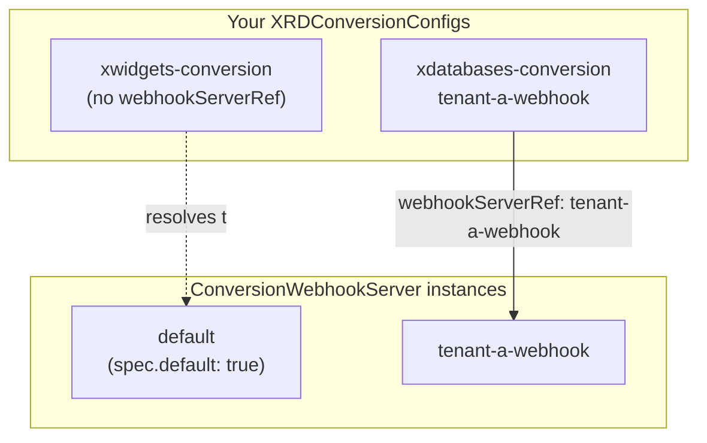

# Configuration

The operator is configured entirely through three cluster-scoped custom resources, all in the `terasky.com/v1alpha1` API group:

| CRD | Purpose |
|---|---|
| [`XRDConversionConfig`](xrdconversionconfig.md) | One per target Crossplane XRD. Declares the hub version and, per spoke version, the declarative rules that convert to and from it. |
| [`CRDConversionConfig`](crdconversionconfig.md) | The same thing for a plain native `CustomResourceDefinition` — identical spec shape and rule vocabulary, different target resource type. |
| [`ConversionWebhookServer`](conversionwebhookserver.md) | A deployable, independently scalable instance of the shared conversion webhook runtime that serves `ConversionReview` requests for both of the above. |

XRD and native-CRD support are independently toggleable — see [Installation: Feature toggles](../installation.md#feature-toggles) — so an installation can run with only one of the two CRDs actually active.

## How they relate

Neither an `XRDConversionConfig` nor a `CRDConversionConfig` runs anything itself — each is a declaration that the operator validates and, once healthy, uses to configure a **`ConversionWebhookServer`** instance to serve that resource's conversions. Most installs only ever need the one `default` instance the Helm chart creates; you'd create more `ConversionWebhookServer` instances for scale-out or to isolate one tenant's conversion traffic from another's, then point specific configs at a non-default instance via `spec.webhookServerRef`.

This resolution — "which `ConversionWebhookServer` serves this config" — is computed by one shared function used identically by the operator's controller and every webhook-server replica, so there's never any ambiguity or drift between what the controller *thinks* is serving a config and what actually is.

See [Architecture](../architecture.md) for how validation, patching, and serving fit together end to end.
