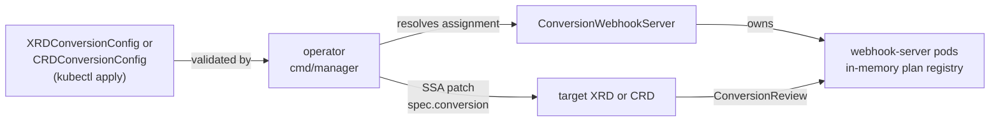

# declarative-conversion-operator

!!! warning "Alpha, under active development"
    APIs (the CRDs, the Helm chart's values, and CLI flags) may still change without notice, and this hasn't yet been run in production. Expect rough edges; issues and feedback are welcome on [GitHub](https://github.com/terasky-oss/declarative-conversion-operator).

**Declarative conversion webhooks for [Crossplane](https://crossplane.io) XRDs *and* plain native Kubernetes CRDs — configure hub/spoke version conversions without hand-writing a webhook.**

## The problem

Both Crossplane [`CompositeResourceDefinition`s](https://docs.crossplane.io/latest/concepts/composite-resource-definitions/) (XRDs) and native Kubernetes `CustomResourceDefinition`s support multiple served API versions. That's great for evolving an API over time — but Kubernetes only lets one of those versions be the *storage* (hub) version, and every other version needs a **conversion webhook** to translate objects to and from it on every read and write.

Today, writing that webhook means:

- Standing up a Go binary that implements the [`ConversionReview`](https://kubernetes.io/docs/tasks/extend-kubernetes/custom-resources/custom-resource-definition-versioning/) protocol correctly.
- Deploying it with its own TLS certificate, `Service`, and wiring it into `spec.conversion` on the target resource by hand.
- Re-implementing basically the same field-mapping logic (rename this, wrap that in an object, join these three fields into one) for every API you version — and getting it wrong is a silent, production-facing data-loss bug, not a compile error.

Most version migrations are not exotic: they're field renames, reshaping a scalar into an object, splitting one field into several, or moving a value into an annotation. **declarative-conversion-operator** lets you describe exactly that, declaratively, and handles the webhook plumbing for you — for a Crossplane XRD via `XRDConversionConfig`, or for a plain native CRD via `CRDConversionConfig`, sharing the exact same rule vocabulary and engine.

## What this operator does

You create one **`XRDConversionConfig`** per Crossplane XRD you want to version-convert, or one **`CRDConversionConfig`** per plain native CRD — both share the identical spec shape and rule vocabulary. Each names:

- the resource's **hub version** (the one Kubernetes/Crossplane already stores objects as),
- for each other served (**spoke**) version, a list of **conversion rules** — one of the built-in strategies like `fieldRename`, `scalarToObject`, `enumRemap`, or `jsonPatch` as an escape hatch (see the [Strategy Reference](strategies/index.md) for the full set).

The operator then:

1. **Validates** the whole mapping against the target resource's real schemas — every hub and spoke field must be explicitly claimed by a rule or be structurally identical on both sides. Nothing is silently dropped.
2. **Analyzes losslessness** per rule, per direction. Anything the engine can't prove round-trips cleanly must be explicitly acknowledged with `acknowledgeLossy: true`, or the config is rejected.
3. **Compiles** the rules into a resolved-path execution plan — no schema walking or YAML parsing on the request hot path.
4. Only once the config is valid *and* a healthy `ConversionWebhookServer` is available, **patches** `spec.conversion` on the target resource via server-side apply, scoped to just that field.

From then on, a shared, horizontally-scalable **`ConversionWebhookServer`** actually serves the `ConversionReview` requests the apiserver sends, converting objects in-memory using the exact same engine the controller validated with.

See [Architecture](architecture.md) for the full picture.

## Why declarative-conversion-operator

- **Declarative, not hand-written.** No Go code, no bespoke webhook deployment per resource — describe the mapping, the operator does the rest.
- **Works for Crossplane XRDs and plain native CRDs alike**, independently toggleable — disable XRD support entirely on clusters without Crossplane installed.
- **Conservative by default.** Any conversion the engine can't prove is lossless is rejected unless you explicitly acknowledge it. Unknown fields are treated as lossy, never silently passed through.
- **Safe by construction.** The target resource is never patched until the config is validated, it's healthy, and the assigned webhook server is confirmed ready. Deleting a config that would leave clients stranded on a non-storage version is blocked, not silently reverted.
- **Fast where it matters.** Every rule is precompiled into a resolved-path plan once; the webhook server's hot path is pure in-memory execution against a lock-free, copy-on-write registry — no network calls, no re-parsing, on the API admission critical path.
- **Testable before it touches a cluster.** The [`convctl` CLI](cli.md) runs the *exact same* conversion engine against local YAML fixtures — or against every real object already in your cluster via `--live` — so you can validate a config before you ever apply it.

## Main use cases

-   :material-arrow-right-bold-circle-outline: **Evolving an XRD's API without breaking clients**

    Rename fields, reshape a scalar into a richer object, or introduce a new required field with a sane default — all while existing clients on an older served version keep working unmodified.

-   :material-shield-check-outline: **Pre-upgrade safety checks**

    Before rolling out a changed `XRDConversionConfig`, run `convctl test --live` against every composite resource that already exists in the cluster — not just hand-written fixtures — and catch a conversion that would break a real object before it ships.

-   :material-source-branch: **Consolidating legacy fields during a v1 → v2 migration**

    Use `fieldsToMap` / `mapToFields`, `arrayToMapByKey` / `mapToArrayByKey`, or `scalarToFields` / `fieldsToScalar` to clean up an API's shape at the hub version while keeping the messier legacy shape alive on an older spoke version for backward compatibility.

-   :material-scale-balance: **Scaling the conversion path independently of the operator**

    Create additional `ConversionWebhookServer` instances for tenant isolation or extra throughput — every replica is symmetric, runs its own informers, and serves from an in-memory registry with no shared state.

## Where to go next

- New to the operator? Start with [Getting Started](getting-started.md).
- Ready to install? See [Installation](installation.md).
- Want a complete, runnable config to copy? See [Examples](examples/index.md).
- Configuring a real XRD? See [XRDConversionConfig](configuration/xrdconversionconfig.md).
- Looking for a specific strategy? See the [Strategy Reference](strategies/index.md).
- Already running and something's off? See [Troubleshooting](operations/troubleshooting.md).
- Wondering what this doesn't do (yet)? See [Limitations](limitations.md) and the [Roadmap](roadmap.md).
