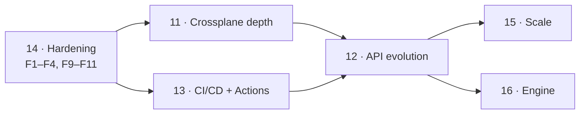

# Review and proposed next phases (11–16)

A review of the project as of the merge of Phase 10 (multi-cluster / GitOps),
and a proposal for what comes next. The emphasis, by request, is on **depth of
Crossplane support**, **XRD API evolution**, and **CLI ergonomics in CI**
(including first-party GitHub Actions).

This is a proposal, not a commitment. The public phase table lives in
[Roadmap](../roadmap.md); this page is the detail behind the entries there.

## Method

Read the full Go tree (~33k lines across 132 files), the Helm chart, the four
GitHub Actions workflows, the e2e scripts, and the published docs. Ran
`go build ./...`, `go vet ./...`, and `go test ./...` — all green at
`de5ff32`. Findings below cite `file:line` so each is checkable.

## Where the project stands

The foundations are genuinely strong, and the review found no architectural
dead ends. In particular:

- **The engine/adapter seam holds.** `pkg/engine` really is Crossplane-agnostic;
  `pkg/xrdadapter` and `pkg/crdadapter` are thin. Adding a third adapter would
  be cheap. That seam is what makes most of the proposals below additive.
- **Fail-closed is the default everywhere that matters.** Uncovered fields are
  errors, unprovable losslessness requires an explicit acknowledgement, and the
  controller gates on XRD health *and* webhook-server readiness before it ever
  patches a live XRD.
- **Passthrough of platform-injected fields is already correct.**
  `pkg/engine/passthrough.go` distinguishes "declared but unclaimed" from
  "never in the schema at all", which is precisely what keeps Crossplane's
  injected `spec.crossplane` / `status.conditions` from being dropped on every
  conversion. This is the kind of detail that usually bites a project a year in.
- **The hot path is honest about its cost.** Copy-on-write registry, atomic-load
  reads, precompiled plans, and published benchmarks.
- **Release engineering is above average for an alpha.** Multi-arch images,
  keyless cosign signing, SBOM and provenance attestations, OCI-published chart.

What the project does *not* yet have is (a) verification that the conversion it
configured actually took effect in Crossplane's generated CRD, (b) support for
the XRD shapes that still generate claims, (c) a first-party way to run
`convctl` in CI, and (d) a few pieces of ordinary production hardening. Those
map onto the phases below.

## Findings

Ordered by severity. Each of these is a concrete, small change; they are folded
into the phases as deliverables rather than left as loose ends.

### F1 — The manager caches every Secret in the cluster

`cmd/manager/main.go:79` constructs the manager with no `Cache` options, and
`internal/controller/xrdconversionconfig_controller.go:422` reads the
cert-manager Secret through the cached client. controller-runtime therefore
starts a cluster-wide Secret informer: the operator process holds **every
Secret in the cluster** in memory, for the sake of one `ca.crt` per
`ConversionWebhookServer`.

This is both a memory problem (Secrets are typically the largest object class
in a cluster) and a blast-radius problem that the RBAC doc
(`docs/security/rbac.md`) already flags as "all Secrets cluster-wide" —
scoping the cache is what makes the RBAC note stop being alarming.

Fix: `Cache.ByObject[&corev1.Secret{}]` scoped to the operator namespace (plus
any explicitly configured server namespaces), or read CA bundles with an
uncached `APIReader`.

### F2 — Webhook-server replicas cache every XRD and every CRD

`--cache-label-selector` (`internal/webhookserver/cache.go:36`) scopes only the
`XRDConversionConfig` / `CRDConversionConfig` informers. The XRD and CRD
informers registered at `internal/webhookserver/reconciler.go:358` and `:379`
are unscoped, so every replica holds every CRD object on the cluster. On a
mature Crossplane cluster that is routinely 500–1500 CRDs whose OpenAPI schemas
are the bulk of their size — tens to hundreds of MB per replica, multiplied by
the replica count, to serve conversions for a handful of targets.

Fix: extend the selector to the schema informers, and add a cache `transform`
that strips `managedFields` and non-target version schemas. Publish the
resulting per-replica memory curve in [Capacity planning](../operations/capacity.md).

### F3 — No timeouts or body limits on either HTTP server

`cmd/webhook-server/main.go:167` (TLS conversion endpoint) and `:172` (plain
health/metrics/debug endpoint) both use `&http.Server{}` with no
`ReadHeaderTimeout`, `ReadTimeout`, `WriteTimeout`, `IdleTimeout`, or
`MaxHeaderBytes`. `internal/webhookserver/server.go:158` decodes the
`ConversionReview` body with no `http.MaxBytesReader`.

A conversion webhook sits in the apiserver's admission path; a slow-loris or an
oversized body is a denial of the write path for the target type. This is
cheap to fix and belongs before any 1.0.

### F4 — A panic loses the request UID

`internal/webhookserver/server.go:144`: the deferred recover calls
`writeReview(w, "", …)`. The apiserver validates that the response UID matches
the request UID, so the operator's carefully-written "internal error: …"
message is replaced by a generic UID-mismatch error. Capture
`review.Request.UID` into a variable the recover closure can read.

### F5 — `convctl test` never validates converted output against the schema

`internal/cli/test.go` round-trips samples and diffs them, but never validates
the converted object against the destination version's OpenAPI schema. A
conversion that produces a missing `required` field, an out-of-enum value, or a
`pattern`/`maxLength` violation is reported as **PASS** by `convctl test` and
then rejected by the apiserver in production, with an error that points at the
object rather than at the rule.

The engine already tracks required-ness (`pkg/engine/schema.go:92`) but only
uses it for a `Delete`-rule warning (`pkg/engine/compile.go:766`). This is the
single highest-value CLI change in the whole proposal: it closes the gap
between "the CLI says the conversion is fine" and "the cluster accepts the
result".

### F6 — The `convctl` image is built in CI but never published

`.github/workflows/ci.yml` builds a `convctl` image in the
`docker-build-check` matrix; `.github/workflows/release.yml` publishes only
`manager` and `webhook-server`. Any container-based CI (Tekton, Argo Workflows,
GitLab CI, a GitHub container job) therefore has no image to use.

### F7 — The reference fleet workflow cannot run

`docs/gitops/convctl-fleet.gha.yml:33` is literally
`echo "install convctl and place it on PATH" >&2; exit 1`. The documented CI
pattern stops at the first step. Phase 13 exists to fix this properly.

### F8 — Crossplane v1 is claimed as "handled identically", but the GVK is pinned to v2

`pkg/xrdadapter/xrdadapter.go:52` hardcodes `apiextensions.crossplane.io/v2`.
On a Crossplane 2.x cluster this is correct and v1-authored XRDs are read
through the v2 endpoint by the apiserver's own conversion. On a Crossplane
**1.x** cluster, where the XRD CRD serves only `v1`/`v1beta1`, the manager
cannot see XRDs at all. [Limitations](../limitations.md) currently reads as if
v1 clusters merely lack CI coverage. Either discover the served version at
startup and support both, or say plainly that Crossplane 2.x is required.

### F9 — No `.golangci.yml`

The `golangci-lint` CI job runs with defaults only (errcheck, govet,
ineffassign, staticcheck, unused). `gosec` would have caught F3; `errorlint`,
`bodyclose`, `copyloopvar`, and `perfsprint` all have something to say about a
codebase this size.

### F10 — Supply-chain and repo hygiene gaps

No `dependabot.yml` or Renovate config, no CodeQL, no `govulncheck` gate, no
image vulnerability scan, no OpenSSF Scorecard, no issue or PR templates, and
no `values.schema.json` for the chart (so a typo in a values key is silent).
For a project that already does cosign + SBOM + provenance, these are the
cheapest remaining wins.

### F11 — Per-batch metrics attribute latency to the last object's direction

`internal/webhookserver/server.go:232`: `direction` is reassigned per object
inside the loop and then used once for the whole batch. In a mixed-direction
batch the histogram lands on whichever object happened to be last. Observe per
object, or label the batch `mixed`.

## Phase 11 — Crossplane integration depth

The theme: stop trusting that patching the XRD was enough, and cover the XRD
shapes that are currently invisible.

### 11.1 Verify propagation into the generated CRD

Today the controller patches `spec.conversion` on the XRD and immediately
reports `Phase=Applied` with `ConditionApplied=True`
(`internal/controller/xrdconversionconfig_controller.go:263-283`). But nothing
converts anything until **Crossplane** re-renders the generated CRD
(`{plural}.{group}`) with that webhook block. Between those two moments — or
forever, if Crossplane is wedged, an old version, or reconciling a paused XRD —
the config reports healthy while conversions fail.

Deliverables:

- Read the generated CRD after the patch; compare its
  `spec.conversion.webhook` (service coordinates, path, `caBundle`,
  `conversionReviewVersions`) against what was applied.
- New condition `ConversionPropagated`, new status block
  `status.generatedCRD{name, propagated, observedCABundleHash, observedAt}`.
- Metric `dco_manager_propagation_lag_seconds` and a `PrometheusRule` alert for
  `Applied AND NOT Propagated` sustained beyond a threshold.
- `convctl` surfaces the same check offline-adjacent: a `--verify-propagation`
  flag on the live commands.

This is the single most important correctness gain available, because it turns
a silent failure mode into a condition.

### 11.2 Claim (XRC) awareness for claim-generating XRDs

An XRD with `claimNames` (Crossplane v1, and `scope: LegacyCluster` in v2)
generates a **second** CRD for the claim type, with its own schema — same
`spec` shape, different machinery fields (`spec.resourceRef` rather than
`spec.resourceRefs`, `spec.compositeDeletePolicy`, no `spec.claimRef`). Nothing
in this repository mentions claims; `test/e2e/testdata/xrd.yaml` is
`scope: Namespaced`, so there is no coverage at all.

Deliverables:

- `xrdadapter` exposes the claim schema alongside the composite schema.
- `Analyze` runs the same rule set against both and reports any field that is
  covered on the composite but uncovered on the claim.
- Propagation verification (11.1) covers both generated CRDs.
- An e2e leg with a claim-generating XRD, asserting a claim created at `v1`
  reads back correctly at `v2`.

Until this lands, `scope: LegacyCluster` should be documented as unsupported
rather than untested.

### 11.3 Composition retarget without Kyverno

`convctl generate kyverno` is a good answer for clusters that run Kyverno, and
the caveats in `docs/cli.md` show how much care went into it. Clusters without
Kyverno currently have no supported path.

Deliverables:

- `convctl retarget --xrd <name> --to <version>` — SSA-patch XRs' `compositionRef` /
  `compositionSelector` directly, with `--dry-run`, `--concurrency`,
  `--canary <n|pct>`, and the same table/JSON reporting as `migrate-storage`.
- `convctl crossplane status <xrd>` — one screen showing, per version:
  served / referenceable / deprecated, live XR count, which Composition each XR
  is pinned to, and which Compositions target which `compositeTypeRef` version.
  This is the missing "what state is my migration actually in" view.

### 11.4 Package-managed XRDs

An XRD installed by a Crossplane `Configuration` package is owned by a
`ConfigurationRevision`. Crossplane's package manager will re-apply its own
rendering of that XRD on upgrade, which can revert the operator's
`spec.conversion` patch — the operator will re-apply it on its next reconcile,
but there is a real window, and nothing tells the user this is happening.

Deliverables: detect a package owner reference on the target XRD, surface
`ManagedByPackage` on status, document the interaction and the recommended
ordering, and add a metric for observed reverts.

### 11.5 Crossplane version support, stated honestly

Resolve F8 — either discover `v1` vs `v2` at startup (a small change: the GVK
becomes a startup-resolved value rather than a package constant) and add a
Crossplane-1.x e2e leg, or state the 2.x requirement in
[Limitations](../limitations.md) and the chart's `NOTES.txt`. The current
wording sits between the two.

## Phase 12 — XRD/CRD API evolution lifecycle

The theme: the individual steps of an API evolution all exist; the *sequence*
lives only in prose, and nothing makes an API change reviewable as a diff.

### 12.1 `convctl plan` — the lifecycle state machine

One command that reads the live XRD, the config, the Compositions, the XR
inventory, and `status.storedVersions`, then prints the ordered sequence from
where you are to where you asked to be: add a version → wire the spoke → verify
→ promote the hub (`rehub`) → retarget Compositions → migrate storage → prune
stored versions → stop serving → drop the version block. Each step carries its
gate ("safe to proceed when …") and the exact command that verifies it.

`examples/crossplane-xr-multiversion/` already encodes this as six numbered
stages; `convctl plan` turns that example into a tool.

### 12.2 Golden-corpus conversion testing

`convctl test --record` writes the hub↔spoke conversion results for the sample
corpus into `testdata/golden/`; `convctl test --golden` replays and fails on any
difference. This is what makes an XRD API change reviewable: the PR diff shows
*"this rule change alters the conversion output for these three objects, in
these fields"* rather than a green check.

This composes with 12.4: record against production objects with
`--live --record`, commit the corpus, and every future config change is graded
against real data with no cluster access.

### 12.3 Output validation and required-field analysis

Deliver F5: `convctl test --validate-output` validates every converted object
against the destination version's OpenAPI schema. Complement it at compile
time — extend the engine's existing required-ness tracking so `Analyze` reports
"spoke `v1` requires `spec.region`, and no rule can produce it for every input"
as a validation error rather than leaving it to fail at admission.

### 12.4 Property-based round-trip testing

`convctl test --fuzz N --seed S` generates schema-valid objects from the XRD's
own `openAPIV3Schema` and round-trips them. Fixtures test the cases the author
thought of; generated objects find the empty array, the absent optional object,
the `maxLength` boundary, and the enum value nobody uses. Deterministic under a
fixed seed so it can gate CI.

### 12.5 Compatibility gate between two git refs

`convctl compat --base <ref> --head <ref>` — given the XRD and config at two
revisions, classify the delta: a direction that went from lossless to lossy, a
field that lost coverage, a served version removed while objects are still
stored at it, a rule deleted. Exit codes designed for a required status check.

This is the branch-protection primitive: "you may not merge a change that makes
an existing conversion lossy without acknowledging it."

### 12.6 Deprecation and version inventory

`convctl versions <xrd>` — per version: served, referenceable, `deprecated` /
`deprecationWarning`, live object count, the version each object was last
written at (readable from `managedFields`), and whether a spoke rule set
exists. Refuse (or loudly warn on) a `served: false` flip while objects are
still stored at, or clients still writing, that version.

## Phase 13 — CI/CD: official GitHub Actions and CLI ergonomics

The theme: `convctl` is designed for CI (exit-code matrix, JUnit output,
`--fail-on`, parallel `--live`) but there is no supported way to *get* it into
a pipeline. Fixing F6 and F7 is the bulk of this phase.

### 13.1 First-party composite Actions

Shipped from this repository under `.github/actions/*`, so they version with
the release tag and are consumable as
`terasky-oss/declarative-conversion-operator/.github/actions/<name>@v1`.

| Action | What it does |
|---|---|
| `setup-convctl` | Downloads a pinned release, **verifies the cosign signature and checksum** (the release already produces both), caches by version, puts it on `PATH`. Inputs: `version` (default: latest), `verify` (default: true). |
| `convctl-test` | Runs `convctl test`, uploads the JUnit report, writes a **job summary** table, and emits `::error file=…,line=…` annotations pointing at the offending rule in the config YAML. |
| `convctl-diff` | Posts/updates a sticky PR comment with the coverage / rule-claim / lossiness delta table. |
| `convctl-fleet` | Matrix wrapper over kubecontexts, one leg per cluster, aggregated report. |

The verification step matters: this project already signs its CLI artifacts
keylessly, and an action that verifies by default turns that investment into
something every consumer benefits from without reading the release notes.

Rewrite `docs/gitops/convctl-fleet.gha.yml` on top of these so the reference
workflow actually runs.

### 13.2 Publish the `convctl` image

Add `convctl` to the release workflow's image matrix
(`ghcr.io/terasky-oss/declarative-conversion-convctl`), with the same signing,
SBOM, and provenance treatment as the other two. Needed for container-job CI,
Tekton, Argo Workflows, and anything not on GitHub.

### 13.3 CI-native output formats

- `--output github` — annotations and a job-summary table.
- `--output sarif` — findings land in GitHub code scanning, so a lossy
  conversion shows up in the Security tab and on the PR diff line.
- `--output markdown` — for PR comments in any CI system.

### 13.4 `convctl lint` — the whole repo at once

A platform repo with 50 XRDs currently needs 50 invocations, each pairing a
config with its schema by hand. `convctl lint ./platform/` walks a tree, pairs
each config with its target schema automatically (by `targetXRD.name` /
`targetCRD.name`), and reports everything in one run — with one exit code. Pair
it with a `pre-commit` hook definition.

### 13.5 Distribution

goreleaser already builds the archives; add the publishing targets that make
the tool installable the way people expect:

- Homebrew tap (`brews`), Scoop, and `nfpms` for deb/rpm.
- A **krew** plugin manifest — `kubectl conversion test|diff|plan` is the
  natural home for a kubectl-adjacent tool, and krew is how the Kubernetes
  ecosystem discovers one.
- `convctl version --output json` with commit, build date, and Go version.
- Reference pipeline templates for GitLab CI, Tekton, and Argo Workflows,
  mirroring the GitHub one.

### 13.6 Large-cluster sampling for `--live`

`internal/cli/live.go` paginates the list but accumulates every object. On a
cluster with tens of thousands of XRs, a pre-upgrade check is an OOM. Add
`--max-samples N` with `--sample-strategy first|random|newest` and a note in
the report that the run was sampled.

## Phase 14 — Production readiness

The theme: the things that stand between "works" and "run it in front of the
apiserver's write path".

- **Fix F1–F4 and F11.** Scoped caches, HTTP timeouts and body limits, the
  panic UID, per-object metric attribution.
- **Rollout safety.** A conversion webhook that 502s during its own rolling
  update fails every write to the target type. Add a `preStop` sleep so
  Endpoints removal precedes process exit, verify `terminationGracePeriodSeconds`
  against the apiserver's 30 s conversion timeout, and default
  `topologySpreadConstraints` / anti-affinity for the webhook-server
  Deployment. Prove it with a soak e2e: roll the webhook-server under sustained
  XR writes and assert **zero** conversion failures.
- **`.golangci.yml`** (F9) with `gosec`, `errorlint`, `bodyclose`,
  `copyloopvar`, `revive`, `perfsprint`.
- **Supply chain** (F10): Dependabot or Renovate, CodeQL, `govulncheck` as a CI
  gate, Trivy image scan, OpenSSF Scorecard badge, issue/PR templates.
- **`values.schema.json`** for the chart, plus `helm-unittest` for the template
  logic the CI job currently greps for.
- **Graduate the API.** `v1alpha1` → `v1beta1` with a conversion path for this
  operator's *own* CRDs — dogfooding the product on itself is both a good test
  and a good demo. Pair with a documented deprecation policy.

## Phase 15 — Scale

- **Automatic sharding.** `assign.ResolveAssignment` supports explicit and
  default assignment; add a policy that balances N targets across M
  `ConversionWebhookServer` instances, with a `spec.shardCount` and rebalance
  that never leaves a target unserved mid-move.
- **Cold start at scale.** With hundreds of targets, every replica compiles
  every assigned plan at startup before it reports ready. Measure it, compile in
  parallel, and publish a cold-start budget alongside the existing compile
  benchmarks.
- **Memory per target.** Publish bytes-per-compiled-plan and the per-replica
  informer cost after F2's scoping. Capacity planning currently covers CPU
  shape but not memory.
- **Raise the tested envelope.** `make test-e2e-scale` reaches 100 targets ×
  100 instances and is explicitly outside the CI matrix. Move it to a **nightly
  scheduled workflow** at a higher envelope (1000 targets) with results
  published as an artifact — a scale target nobody runs is a scale target
  nobody trusts.
- **Workqueue observability.** Expose controller-runtime's workqueue depth and
  latency in the shipped dashboards; they are the leading indicator of a
  reconcile backlog.

## Phase 16 — Engine and strategy expansion

- **Required-field satisfaction analysis** (see 12.3) — the highest-value
  engine change, because it converts a production admission failure into a
  compile-time error.
- **`oneOf` / `anyOf` branch mapping.** Currently opaque and documented as out
  of scope. Union-typed API fields are common in mature XRDs, and a branch-aware
  strategy (`branchMap`) would unblock migrations that today need `jsonPatch`.
- **`$ref` / `allOf` flattening** so shared sub-schemas stop being opaque units.
- **Spoke-to-spoke shortcut plans**, if the 2.3× hub-hop cost ever shows up in
  a real profile. Listed for completeness; the measured numbers do not justify
  it yet.
- **Strategy additions driven by real migrations only.** The `Strategy` enum and
  discriminated union were built for this; the discipline of "a real migration
  asked for it" is what has kept 29 strategies coherent.

## Sequencing

Two notes on ordering:

1. **Phase 14's findings should not wait for a phase.** F3 and F4 are hours of
   work each; F1 and F2 are the difference between "runs on a lab cluster" and
   "runs on a cluster with 1200 CRDs". Land them as they come up.
2. **Phase 13 before Phase 12.** The evolution features (golden corpus, compat
   gate, output validation) are only valuable if a pipeline can run them, and
   today no pipeline can install the CLI (F6, F7). Build the road before the
   traffic.

## Explicit non-goals

Unchanged from the current roadmap, and worth restating because each one keeps
the design small:

- **No cross-cluster coordination.** Fleet consistency is a CI property, not a
  runtime one.
- **No runtime state shared between webhook-server replicas.** The absence of a
  shared cache is what keeps the admission path free of network dependencies.
- **No inference of conversion intent.** `convctl suggest` proposes; it never
  concludes. A `ScalarToFields` split stays a human decision.
- **Not a general-purpose transformation engine.** Every strategy earns its
  place by appearing in a real migration.
