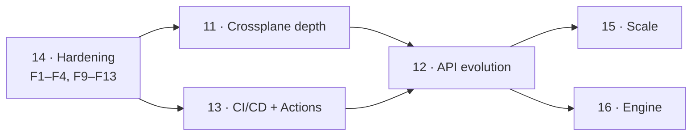

# Review and proposed next phases (11–16)

A review of the project as of the merge of Phase 10 (multi-cluster / GitOps),
and a proposal for what comes next. The emphasis, by request, is on **depth of
Crossplane support**, **XRD API evolution**, and **CLI ergonomics in CI**
(including first-party GitHub Actions).

This is a proposal, not a commitment. The public phase table lives in
[Roadmap](../roadmap.md); this page is the detail behind the entries there.

## Method

Read the full Go tree (~33k lines across 132 files), the Helm chart, the four
GitHub Actions workflows, the e2e scripts, and the published docs. Ran
`go build ./...`, `go vet ./...`, and `go test ./...` — all green at
`de5ff32`. Findings below cite `file:line` so each is checkable.

## Where the project stands

The foundations are genuinely strong, and the review found no architectural
dead ends. In particular:

- **The engine/adapter seam holds.** `pkg/engine` really is Crossplane-agnostic;
  `pkg/xrdadapter` and `pkg/crdadapter` are thin. Adding a third adapter would
  be cheap. That seam is what makes most of the proposals below additive.
- **Fail-closed is the default everywhere that matters.** Uncovered fields are
  errors, unprovable losslessness requires an explicit acknowledgement, and the
  controller gates on XRD health *and* webhook-server readiness before it ever
  patches a live XRD.
- **Passthrough of platform-injected fields is already correct, in every
  scope.** `pkg/engine/passthrough.go` distinguishes "declared but unclaimed"
  from "never in the schema at all", key by key against the authored schema.
  That is what keeps Crossplane's injected fields from being dropped on every
  conversion — and because the check is key-by-key rather than a special case
  for `spec.crossplane`, it handles the `LegacyCluster` layout (machinery
  fields directly under `spec`) with no code of its own. Verified below rather
  than assumed. This is the kind of detail that usually bites a project a year
  in.
- **The hot path is honest about its cost.** Copy-on-write registry, atomic-load
  reads, precompiled plans, and published benchmarks.
- **Release engineering is ahead of the maturity label.** Multi-arch images,
  keyless cosign signing, SBOM and provenance attestations, OCI-published chart.

What the project does *not* yet have is (a) verification that the conversion it
configured actually took effect in Crossplane's generated CRD, (b) tooling that
knows a claim-offering XRD has a second CRD, (c) a first-party way to run
`convctl` in CI, and (d) a few pieces of ordinary production hardening. Those
map onto the phases below.

## Deep dive: the fields Crossplane injects

Everything in this section was read out of
[`crossplane-runtime/pkg/xcrd`](https://github.com/crossplane/crossplane-runtime/tree/main/pkg/xcrd)
(`schemas.go`, `crd.go`) at `5b9c969`, not inferred from docs. It is the exact
set of properties Crossplane merges into every generated CRD, and it is what
the engine's passthrough has to leave alone.

### Where the machinery lives, per scope

`CompositeResourceSpecProps` branches on scope. Modern scopes nest everything
under one `spec.crossplane` key; **`LegacyCluster` keeps the v1 layout, with
the machinery fields directly under `spec`, as siblings of the author's own
fields** — and adds two fields the modern scopes do not have.

| Injected property | `Namespaced` | `Cluster` | `LegacyCluster` |
|---|---|---|---|
| `compositionRef` | `spec.crossplane.` | `spec.crossplane.` | `spec.` |
| `compositionSelector` | `spec.crossplane.` | `spec.crossplane.` | `spec.` |
| `compositionRevisionRef` | `spec.crossplane.` | `spec.crossplane.` | `spec.` |
| `compositionRevisionSelector` | `spec.crossplane.` | `spec.crossplane.` | `spec.` |
| `compositionUpdatePolicy` | `spec.crossplane.` | `spec.crossplane.` | `spec.` |
| `resourceRefs[]` | `spec.crossplane.` — items **without** `namespace` | `spec.crossplane.` — items **with** `namespace` | `spec.` — items **with** `namespace` |
| `claimRef` | — | — | `spec.claimRef` |
| `writeConnectionSecretToRef` | — | — | `spec.` (`name` + `namespace`) |
| `status.conditions` | ✓ | ✓ | ✓ |
| `status.connectionDetails` | — | — | ✓ (`lastPublishedTime`) |
| `status.claimConditionTypes` | — | — | ✓ |

There is **no `status.crossplane`** in any scope. `BaseProps()` additionally
declares `apiVersion`, `kind`, `metadata` (narrowed to `name`, with
`maxLength: 63`), `spec` and `status`, and makes `spec` required at the root.

### The claim CRD

A `LegacyCluster` XRD with `claimNames` produces a **second** CRD,
`{claimPlural}.{group}`, namespace-scoped. Three things about it matter here:

1. **It carries the same `spec.conversion`.** `ForCompositeResourceClaim`
   copies `xrd.Spec.Conversion` exactly as `ForCompositeResource` does — so the
   claim CRD points at the same webhook, at the same `/convert/<xrd-name>` path,
   and lands on the same compiled plan in this operator's registry.
2. **It shares the authored schema.** Both CRDs are built from the same
   `spec.versions[].schema.openAPIV3Schema`, so a rule written against
   `spec.foo` is correct for claims without any extra work.
3. **Its machinery fields differ.** `resourceRef` (singular object, not the
   `resourceRefs` array), `compositeDeletePolicy`, and a
   `writeConnectionSecretToRef` that takes only `name` — no `namespace`.
   Its status is the `LegacyCluster` status set, `claimConditionTypes`
   included, which upstream marks as a known bug in a `TODO`.

The consequence is good news and bad news. Conversion of claim objects already
works, because the shared authored schema makes the plan correct and
passthrough covers the machinery. But every part of the tooling that resolves a
target by `spec.names.plural` is blind to the claim CRD's existence — see F8.

### What was verified, not assumed

Two claims in the earlier draft needed checking. Both were tested against
`pkg/engine` directly:

- **`status.conditions` is not dropped.** The concern that the engine discards
  conditions is unfounded. `passthroughUnknownOp` copies the whole
  `status.conditions` value through untouched in both directions, so
  Crossplane-owned conditions (`Synced`, `Ready`) and conditions written by
  anyone else survive identically — the engine never inspects, filters, or
  reconstructs the array, which is exactly the right behaviour given that
  condition ownership is not knowable from the schema. A round trip carrying
  three conditions, one of them author-defined, came back byte-identical.
- **The legacy layout passes through correctly.** All eight `LegacyCluster`
  machinery fields sitting directly under `spec`, plus
  `status.connectionDetails` and `status.claimConditionTypes`, round-tripped
  unchanged alongside ruled fields. The mechanism is key-by-key against the
  authored schema, so it is layout-agnostic by construction: it never had a
  special case for `spec.crossplane` to begin with.

Both deserve permanent regression tests named for the scope they cover — the
existing test mentions `spec.crossplane` in a comment but only exercises
`status.conditions`, so the legacy layout is currently correct by accident
rather than by assertion.

## Deep dive: package-managed XRDs are reverted, repeatedly

An XRD shipped inside a Crossplane `Configuration` package **does** lose its
conversion webhook, and not only on upgrade. This was traced through
Crossplane's package establisher and XRD definition controller at
`3d8d7c1`; every claim below cites the line it came from.

### The mechanism

`APIEstablisher.update` ends like this
(`internal/controller/pkg/revision/establisher.go:591`):

```go
// This should be a server side apply?
return e.client.Update(ctx, desired, opts...)
```

That comment is upstream acknowledging exactly this problem. `desired` is the
XRD **as it appears in the package**, with `ownerReferences` and
`resourceVersion` copied from the live object and nothing else preserved: the
`merge` step immediately above it special-cases only
`ManagedResourceDefinition.spec.state` and returns `nil` for every other kind
(`establisher.go:695`). A `client.Update` is a full replace — it is not
merge-aware and does not respect Server-Side Apply field ownership — so
**`spec.conversion` is removed**, along with the operator's
`conversion.terasky.com/managed-by` and `plan-hash` annotations.

Three things make this worse than a one-off:

1. **`Establish` runs on every reconcile.** There is no early return for a
   healthy revision, and `establish` calls `update` unconditionally for every
   object that already exists — there is no diff check
   (`establisher.go:505`).
2. **Reconciles are not rare.** The manager's `SyncPeriod` is Crossplane's
   `--sync` flag, which **defaults to one hour**
   (`cmd/crossplane/core/core.go:112`). Each resync re-delivers every
   `ConfigurationRevision` as an update event. A `Lock` change — any package
   installed, upgraded or removed anywhere on the cluster — and any Crossplane
   restart do the same.
3. **The failure is silent, not loud.** Once `spec.conversion` is gone from the
   XRD, Crossplane's definition controller re-renders the generated CRD without
   it, and the CRD falls back to `strategy: None`. The apiserver then serves a
   stored object at a different version by relabelling `apiVersion` and
   returning the original field layout. Clients get wrong data with a 200, and
   writes during the window persist the wrong shape. No error is raised
   anywhere.

The operator does re-apply — it watches XRDs, so Crossplane's write enqueues a
reconcile immediately, and there is a 5-minute periodic self-check besides. The
exposure is a race of seconds, roughly hourly, per package-managed XRD. That is
small, and it is exactly the profile of a bug nobody can reproduce.

### Why the obvious fix does not work

The instinct is to patch the **generated CRD** instead of the XRD, on the
theory that Crossplane only owns the XRD. It does not help. The definition
controller applies the rendered CRD through
`resource.NewAPIUpdatingApplicator` (`definition/reconciler.go:261`, directly
under a `TODO(negz): Use server-side apply instead of a ClientApplicator`),
and that applicator's `Apply` is a `Get` followed by a full `client.Update`
(`crossplane-runtime/pkg/resource/api.go:103`). A CRD-level patch is reverted
by the same mechanism, on a controller that reconciles on *every* XRD change
rather than hourly. Both write paths are non-SSA full replaces; there is no
object in the chain where field ownership survives.

The other non-fix is to ask the platform team to put `spec.conversion` into the
Configuration. That works, and it is what you would tell someone today — but it
inverts the whole point of the operator (the conversion stanza would have to
hard-code a service name, namespace and CA bundle into a portable package), and
the brief here is explicitly to solve it **without** changing the Configuration.

### The fix: guard the field in admission

The only place a non-SSA `Update` can be corrected without the writer's
cooperation is before it is persisted. A **mutating admission webhook on
`compositeresourcedefinitions`** re-injects `spec.conversion` — and the two
annotations — into any CREATE or UPDATE whose result would drop or alter what
the operator has applied.

Why this is the right shape:

- **The window closes completely.** The field is restored inside the same
  request, so there is no interval during which the generated CRD lacks
  conversion. Compare the current behaviour, where correctness depends on
  winning a race after the fact.
- **Nothing outside this operator changes.** The Configuration package, the
  `ConfigurationRevision`, and Crossplane itself are untouched. The package
  manager's `Update` succeeds; it never re-reads the object to compare, and the
  `ConfigurationRevision` controller does not watch the XRDs it establishes
  (`revision/reconciler.go:295` — it watches only `ConfigurationRevision`,
  `Lock` and `ImageConfig`), so there is no fight loop.
- **The operator already has what it needs.** `TargetXRDNameIndex` is an
  existing field index from XRD name to the config that targets it, built for
  the admission webhook's uniqueness check. The guard is an in-memory lookup on
  the request path — no extra API calls.
- **It is a bridge, not a fixture.** Both upstream write paths carry a TODO to
  move to Server-Side Apply. The day either one does, our SSA field ownership
  holds on its own and the guard becomes a no-op that can be retired.

Details that decide whether it is safe:

- **`failurePolicy: Ignore`.** An admission guard that can block XRD writes when
  the operator is down would make package installs depend on this operator's
  availability — unacceptable for something that is meant to be additive. Fail
  open, and keep the existing controller re-apply as the backstop: normal
  operation has no window, degraded operation is exactly today's behaviour.
- **Scope it by the index, not by a label.** The tempting `objectSelector` on a
  label the operator sets is self-defeating: that label is wiped by the very
  `Update` we are guarding against. Match all XRD CREATE/UPDATE and return
  early on an index miss — XRDs are few and writes to them are rare.
- **Only ever add.** The guard restores what the operator's own controller
  would apply and refuses to touch a `spec.conversion` pointing anywhere else,
  so an XRD deliberately wired to a hand-written webhook is left alone.
- **Make it observable either way.** A `PackageManaged` condition (derived from
  an owner reference to a `ConfigurationRevision`) and a
  `dco_manager_conversion_reverts_total` counter, so an operator can see the
  revert happening and confirm the guard caught it.

## Findings

Ordered by severity. Each of these is a concrete, small change; they are folded
into the phases as deliverables rather than left as loose ends.

### F1 — The manager caches every Secret in the cluster

> **Delivered in phase 14.** Secrets are excluded from the manager's client
> cache entirely (`client.CacheOptions.DisableFor`) rather than scoped, so
> there is no Secret informer at all; the owned workload informers are
> label-scoped to this operator's own children. Measured before/after in
> [Capacity planning](../operations/capacity.md#memory-the-manager).


`cmd/manager/main.go:79` constructs the manager with no `Cache` options, and
`internal/controller/xrdconversionconfig_controller.go:422` reads the
cert-manager Secret through the cached client. controller-runtime therefore
starts a cluster-wide Secret informer: the operator process holds **every
Secret in the cluster** in memory, for the sake of one `ca.crt` per
`ConversionWebhookServer`.

This is both a memory problem (Secrets are typically the largest object class
in a cluster) and a blast-radius problem that the RBAC doc
(`docs/security/rbac.md`) already flags as "all Secrets cluster-wide" —
scoping the cache is what makes the RBAC note stop being alarming.

Fix: `Cache.ByObject[&corev1.Secret{}]` scoped to the operator namespace (plus
any explicitly configured server namespaces), or read CA bundles with an
uncached `APIReader`.

### F2 — Webhook-server replicas cache every XRD and every CRD

> **Delivered in phase 14,** with one deviation: the cache transform strips
> `managedFields` and the kubectl last-applied annotation but does **not**
> prune non-target version schemas. The cache is built before any config is
> read and configs are retargeted at runtime, so a version pruned at startup
> would be silently missing when a config later names it — and a conversion
> against a truncated schema returns wrong data rather than failing. Recorded
> in [Limitations](../limitations.md). Also note that `--cache-label-selector`
> now covers the schema informers, which requires labelling targets; see the
> [upgrade runbook](../operations/upgrade-runbook.md#upgrading-the-chart).


`--cache-label-selector` (`internal/webhookserver/cache.go:36`) scopes only the
`XRDConversionConfig` / `CRDConversionConfig` informers. The XRD and CRD
informers registered at `internal/webhookserver/reconciler.go:358` and `:379`
are unscoped, so every replica holds every CRD object on the cluster. On a
mature Crossplane cluster that is routinely 500–1500 CRDs whose OpenAPI schemas
are the bulk of their size — tens to hundreds of MB per replica, multiplied by
the replica count, to serve conversions for a handful of targets.

Fix: extend the selector to the schema informers, and add a cache `transform`
that strips `managedFields` and non-target version schemas. Publish the
resulting per-replica memory curve in [Capacity planning](../operations/capacity.md).

### F3 — No timeouts or body limits on either HTTP server

> **Delivered in phase 14.** All five timeout/limit fields on both servers,
> plus `--max-request-bytes` with an `http.MaxBytesReader` and a per-request
> deadline the conversion loop honours. An oversized body is answered with a
> well-formed failing `ConversionReview` carrying the request's own UID —
> recovered from the retained prefix of the body, because the apiserver
> discards a response whose UID does not match.


`cmd/webhook-server/main.go:167` (TLS conversion endpoint) and `:172` (plain
health/metrics/debug endpoint) both use `&http.Server{}` with no
`ReadHeaderTimeout`, `ReadTimeout`, `WriteTimeout`, `IdleTimeout`, or
`MaxHeaderBytes`. `internal/webhookserver/server.go:158` decodes the
`ConversionReview` body with no `http.MaxBytesReader`.

A conversion webhook sits in the apiserver's admission path; a slow-loris or an
oversized body is a denial of the write path for the target type. This is
cheap to fix and belongs before any 1.0.

### F4 — A panic loses the request UID

> **Delivered in phase 14.** The recover path writes the decoded UID, logs the
> stack at error level, and increments `dco_webhook_conversion_panics_total`,
> which has its own critical alert with no `for:` delay.


`internal/webhookserver/server.go:144`: the deferred recover calls
`writeReview(w, "", …)`. The apiserver validates that the response UID matches
the request UID, so the operator's carefully-written "internal error: …"
message is replaced by a generic UID-mismatch error. Capture
`review.Request.UID` into a variable the recover closure can read.

### F5 — `convctl test` never validates converted output against the schema

`internal/cli/test.go` round-trips samples and diffs them, but never validates
the converted object against the destination version's OpenAPI schema. A
conversion that produces a missing `required` field, an out-of-enum value, or a
`pattern`/`maxLength` violation is reported as **PASS** by `convctl test` and
then rejected by the apiserver in production, with an error that points at the
object rather than at the rule.

The engine already tracks required-ness (`pkg/engine/schema.go:92`) but only
uses it for a `Delete`-rule warning (`pkg/engine/compile.go:766`). This is the
single highest-value CLI change in the whole proposal: it closes the gap
between "the CLI says the conversion is fine" and "the cluster accepts the
result".

### F6 — The `convctl` image is built in CI but never published

`.github/workflows/ci.yml` builds a `convctl` image in the
`docker-build-check` matrix; `.github/workflows/release.yml` publishes only
`manager` and `webhook-server`. Any container-based CI (Tekton, Argo Workflows,
GitLab CI, a GitHub container job) therefore has no image to use.

### F7 — The reference fleet workflow cannot run

`docs/gitops/convctl-fleet.gha.yml:33` is literally
`echo "install convctl and place it on PATH" >&2; exit 1`. The documented CI
pattern stops at the first step. Phase 13 exists to fix this properly.

### F8 — On a `LegacyCluster` XRD, the claim CRD is invisible to the tooling

> **Delivered in phase 11.** `xrdadapter.GeneratedCRDNames` is now the one place
> "which CRDs does this XRD generate" is answered; `test --live`,
> `migrate-storage` and propagation verification all use it. A failure on either
> CRD blocks the prune on both.

Every path that resolves a target reads `spec.names.plural` and never
`spec.claimNames.plural` (`internal/cli/live.go:78`,
`internal/cli/migratestorage.go:373-386`). On a claim-offering XRD that is
three separate blind spots:

- `convctl test --live` samples composite resources only. Claims are their own
  stored object class with their own instances, so the pre-upgrade check
  silently covers half the objects that will actually go through the webhook.
- `migrate-storage --prune-stored-versions` rewrites and prunes the composite
  CRD only. The claim CRD's objects stay encoded at the old version and its
  `status.storedVersions` never shrinks — so the version still cannot be
  dropped from the XRD, which is the entire point of running the command.
- Propagation (11.1) has two CRDs to verify, not one.

Conversion of claim objects itself already works: the claim CRD carries the
same `spec.conversion` and is built from the same authored schema, so it lands
on the same compiled plan and the machinery fields are handled by passthrough.
This is a tooling gap, not an engine gap.

### F9 — An authored field that Crossplane will overwrite draws no diagnostic

> **Delivered in phase 11.** Two new error diagnostics,
> `AuthoredFieldShadowedByPlatform` and `RuleTargetsInjectedPath`, driven by a
> scope-specific injected-path set the adapter supplies through an optional
> `engine.PlatformAwareSource` interface — so `pkg/engine` still does not know
> Crossplane exists, and every existing caller picked the check up unchanged.

`genCrdVersion` copies the author's properties into the generated CRD first,
then `ForCompositeResource` copies the injected properties over the top. So an
XRD that declares, say, `spec.crossplane` on a `Namespaced` XR, or its own
`status.conditions`, has that declaration **silently replaced** in the CRD the
apiserver actually enforces.

The engine analyses the authored schema, so it happily compiles rules against a
subtree that will never exist at runtime. Confirmed by test: an authored
`spec.crossplane` compiles with zero errors and zero warnings. `Analyze` should
reject a collision with the injected set for the XRD's scope.

### F10 — Scope read at `v2` may not be the scope Crossplane uses

> **Not reproducible; corrected in phase 11.** The premise was checked on kind
> v1.35.0 with Crossplane v2.4.0 before anything was built, exactly as the
> finding asked. The differing defaults are real — `v1` defaults `spec.scope` to
> `LegacyCluster`, `v2` to `Namespaced`, and the XRD CRD does serve both with
> `strategy: None`. **But structural-schema defaulting runs on the WRITE path
> and the defaulted value is persisted**, so an XRD applied at `v1` with
> `spec.scope` omitted reads back as `LegacyCluster` at *both* versions. (The
> `v2` read returns `LegacyCluster` even though it is outside `v2`'s own enum,
> which confirms the stored value passes straight through rather than being
> re-derived.) A live XRD's `spec.scope` is therefore authoritative and there is
> no cross-read to do.
>
> What genuinely remains is the **offline** case, and it is the common one: a
> hand-written XRD YAML that omits `spec.scope` has never been through
> admission, so `convctl analyze --xrd ./xrd.yaml` cannot know which scope the
> cluster will pick — it depends on the API version the manifest is applied at.
> `xrdadapter.ResolveScope` reports that as `Indeterminate` rather than guessing,
> and cross-checks `spec.claimNames` / `spec.connectionSecretKeys`, whose
> presence Crossplane's own CEL rule ties to `LegacyCluster`. The measurement is
> recorded in `pkg/xrdadapter/scope_test.go`.

The original finding, for the record:

The XRD CRD serves `v1` (storage) and `v2` with **no conversion webhook**
(`strategy: None`), and the two versions default `spec.scope` differently:
`v1` defaults to `LegacyCluster`, `v2` to `Namespaced`. An XRD persisted
without an explicit `scope` — the shape a Crossplane 1.x cluster leaves behind
after an upgrade — was expected to default differently depending on which
version you read it at, and this operator reads at `v2`
(`pkg/xrdadapter/xrdadapter.go:52`).

### F11 — No `.golangci.yml`

> **Delivered in phase 14.** `.golangci.yml` enables `gosec`, `errorlint`,
> `bodyclose`, `copyloopvar`, `nilerr`, `nilnil`, `perfsprint`,
> `usestdlibvars`, `misspell`, `godot`, `whitespace`, and a curated `revive`
> subset. All 71 findings were fixed rather than baselined; the three checked
> type assertions it surfaced in index functions and on the conversion hot
> path were real panic vectors. `make lint` runs the same config and version
> as CI.


The `golangci-lint` CI job runs with defaults only (errcheck, govet,
ineffassign, staticcheck, unused). `gosec` would have caught F3; `errorlint`,
`bodyclose`, `copyloopvar`, and `perfsprint` all have something to say about a
codebase this size.

### F12 — Supply-chain and repo hygiene gaps

> **Delivered in phase 14.** Dependabot (gomod/actions/docker, grouped),
> `govulncheck` and CodeQL as CI jobs, OpenSSF Scorecard with a README badge,
> a Trivy scan of the pushed image digest in the release workflow, issue and
> PR templates, least-privilege `permissions:` on every workflow, and a chart
> `values.schema.json` with `helm-unittest` suites replacing the `grep`
> assertions. `govulncheck` required bumping the Go toolchain to 1.26.6.


No `dependabot.yml` or Renovate config, no CodeQL, no `govulncheck` gate, no
image vulnerability scan, no OpenSSF Scorecard, no issue or PR templates, and
no `values.schema.json` for the chart (so a typo in a values key is silent).
For a project that already does cosign + SBOM + provenance, these are the
cheapest remaining wins.

### F13 — Per-batch metrics attribute latency to the last object's direction

> **Delivered in phase 14,** additively: the review-level histogram now labels
> a multi-direction batch `mixed`, and a new
> `dco_webhook_conversion_object_duration_seconds` carries the exact
> direction per object. A `dco_webhook_conversion_batch_size` histogram was
> added as the missing input for sizing `--max-request-bytes`.


`internal/webhookserver/server.go:232`: `direction` is reassigned per object
inside the loop and then used once for the whole batch. In a mixed-direction
batch the histogram lands on whichever object happened to be last. Observe per
object, or label the batch `mixed`.

### F14 — A package-managed XRD loses its conversion webhook roughly hourly

> **Delivered in phase 11.** The mutating admission guard ships behind
> `--enable-xrd-conversion-guard` (default on), alongside a `PackageManaged`
> condition and a `dco_manager_conversion_reverts_total` counter that make the
> hazard visible whether or not the guard is enabled. See
> [Architecture](../architecture.md#the-xrd-conversion-guard).

Crossplane's package establisher writes established objects with a full
`client.Update` from the package contents, not a Server-Side Apply
(`establisher.go:591-592`), and `Establish` runs on every revision reconcile —
which the default one-hour `--sync` resync guarantees. So any XRD shipped in a
`Configuration` has `spec.conversion` stripped on a recurring basis, and the
generated CRD falls back to `strategy: None` until the operator re-applies.
Objects served during that window come back relabelled but unconverted, with a
200 and no error.

Patching the generated CRD instead does not help — the definition controller
applies it through `APIUpdatingApplicator`, which is also a full `Update`. The
fix is a mutating admission guard on XRD writes; both the mechanism and the
design are in the [deep dive](#deep-dive-package-managed-xrds-are-reverted-repeatedly).

## Phase 11 — Crossplane integration depth

> **Shipped.** Every deliverable below landed, with two deviations worth
> recording: `status.generatedCRD` became `status.generatedCRDs`, a list,
> because a claim-offering XRD has two CRDs and a singular block cannot express
> a half-propagated pair; and F10 turned out not to be reproducible (see above),
> so scope resolution is smaller than the design assumed. The package-managed
> e2e leg replays the establisher's exact non-SSA write rather than installing a
> real `Configuration` — see the note in `hack/e2e-test-package-managed.sh`.

The theme: stop trusting that patching the XRD was enough, and cover the XRD
shapes that are currently invisible.

### 11.1 Verify propagation into the generated CRD

Today the controller patches `spec.conversion` on the XRD and immediately
reports `Phase=Applied` with `ConditionApplied=True`
(`internal/controller/xrdconversionconfig_controller.go:263-283`). But nothing
converts anything until **Crossplane** re-renders the generated CRD
(`{plural}.{group}`) with that webhook block. Between those two moments — or
forever, if Crossplane is wedged, an old version, or reconciling a paused XRD —
the config reports healthy while conversions fail.

Deliverables:

- Read the generated CRD after the patch; compare its
  `spec.conversion.webhook` (service coordinates, path, `caBundle`,
  `conversionReviewVersions`) against what was applied.
- New condition `ConversionPropagated`, new status block
  `status.generatedCRD{name, propagated, observedCABundleHash, observedAt}`.
- Metric `dco_manager_propagation_lag_seconds` and a `PrometheusRule` alert for
  `Applied AND NOT Propagated` sustained beyond a threshold.
- `convctl` surfaces the same check offline-adjacent: a `--verify-propagation`
  flag on the live commands.

This is the single most important correctness gain available, because it turns
a silent failure mode into a condition.

### 11.2 `LegacyCluster` scope and claims

`scope: LegacyCluster` is the v1 compatibility layer inside Crossplane 2.x, and
it is the shape every cluster upgraded from 1.x still runs. It is not exotic
and it is not going away — but nothing in this repository mentions it, and the
e2e fixture is `scope: Namespaced`, so coverage is zero.

The good news from the [deep dive](#deep-dive-the-fields-crossplane-injects) is
that the **engine already handles it**: the machinery fields sit directly under
`spec` rather than under `spec.crossplane`, and passthrough is key-by-key
against the authored schema, so the legacy layout round-trips unchanged. What
is missing is everything around the engine.

Deliverables:

- **Lock the behaviour down with tests.** A regression test per scope covering
  the exact injected set: `spec.crossplane.*` with and without
  `resourceRefs[].namespace` for `Namespaced` / `Cluster`, and the eight
  `spec.*` machinery fields plus `claimRef`, `writeConnectionSecretToRef`,
  `status.connectionDetails` and `status.claimConditionTypes` for
  `LegacyCluster`. Today the legacy layout is correct by accident, not by
  assertion.
- **Teach the tooling the claim CRD exists.** Resolve `spec.claimNames.plural`
  alongside `spec.names.plural` so `test --live` samples claims,
  `migrate-storage` rewrites and prunes both CRDs, and propagation
  verification (11.1) checks both. This is F8, and the `migrate-storage` half
  of it is the difference between "prune ran" and "the version can actually be
  dropped".
- **Scope-aware validation.** `Analyze` knows the XRD's scope, so it can reject
  an authored field name that Crossplane will overwrite (F9) and warn on a rule
  targeting a path that is injected rather than authored.
- **An e2e leg on a `LegacyCluster` XRD**, asserting that both a composite
  created at `v1` and a **claim** created at `v1` read back correctly converted
  at `v2`, and that the machinery fields and every condition survive.
- **Say what `convctl` needs.** `convctl analyze` and `test` should print the
  detected scope, so an author can see which injected set is in play without
  reading this page.

### 11.3 Composition retarget without Kyverno

`convctl generate kyverno` is a good answer for clusters that run Kyverno, and
the caveats in `docs/cli.md` show how much care went into it. Clusters without
Kyverno currently have no supported path.

Deliverables:

- `convctl retarget --xrd <name> --to <version>` — SSA-patch XRs' `compositionRef` /
  `compositionSelector` directly, with `--dry-run`, `--concurrency`,
  `--canary <n|pct>`, and the same table/JSON reporting as `migrate-storage`.
- `convctl crossplane status <xrd>` — one screen showing, per version:
  served / referenceable / deprecated, live XR count, which Composition each XR
  is pinned to, and which Compositions target which `compositeTypeRef` version.
  This is the missing "what state is my migration actually in" view.

### 11.4 Package-managed XRDs: the admission guard

Deliver F14. An XRD shipped in a `Configuration` is the mainstream way to ship
a Crossplane API, and today this operator does not survive contact with one for
more than an hour at a time.

Deliverables:

- **A mutating admission webhook on `compositeresourcedefinitions`** that
  re-injects `spec.conversion` and the operator's two annotations into any
  write that would drop them, resolved through the existing
  `TargetXRDNameIndex`. `failurePolicy: Ignore`, add-only, and a no-op for an
  XRD pointing at somebody else's webhook. Rationale and the failure modes it
  has to respect are in the deep dive.
- **A `PackageManaged` condition** on the config, derived from an owner
  reference to a `ConfigurationRevision`, plus
  `dco_manager_conversion_reverts_total` so the revert is visible whether or
  not the guard caught it. This is worth shipping even before the guard: it
  turns an invisible hazard into a number.
- **An e2e leg that actually reverts.** Install a `Configuration` whose XRD has
  no conversion stanza, apply an `XRDConversionConfig`, then force a revision
  reconcile and assert that a read at a non-storage version stays correct
  throughout. Without this the guard is untested against the thing it exists
  for.
- **Retire-ability.** Both upstream write paths carry a TODO to move to
  Server-Side Apply. Gate the guard behind a flag so it can be turned off once
  a Crossplane version lands that no longer needs it, and say in the docs which
  version that is when it arrives.

### 11.5 Crossplane 2.x only, stated plainly

Crossplane 1.x clusters are **out of scope** — not "untested", not "handled
identically by the code path". The `v2` XRD API is what this operator reads,
and a 1.x cluster does not serve it. Say so in
[Limitations](../limitations.md), the chart's `NOTES.txt`, and the README, and
delete the wording that currently implies otherwise.

What that does *not* drop is the v1 compatibility layer **inside** Crossplane
2.x: `scope: LegacyCluster` is expressed through the still-served
`apiextensions.crossplane.io/v1` XRD API, and it is a first-class target
(11.2). Separately, resolve F10 by deriving scope from something more
trustworthy than a defaulted `spec.scope` read at `v2`.

## Phase 12 — XRD/CRD API evolution lifecycle

> **Shipped.** Every deliverable below landed. Four deviations are worth
> recording:
>
> - **`convctl plan` is offline, not live.** The design had it reading the live
>   XRD, the Compositions, the XR inventory and `status.storedVersions`. It
>   reads manifests instead, and the three steps whose completion genuinely
>   lives in the cluster — retargeting Compositions, migrating storage, pruning
>   `storedVersions` — are reported as `UNKNOWN` carrying the command that
>   answers them, rather than guessed at. `UNKNOWN` neither becomes the next
>   step nor blocks the ones after it; marking it `READY` would claim a check
>   that never happened, and `BLOCKED` would hide the whole remaining tail of a
>   late-stage plan. A files-only command also works in a PR, which is where
>   the question usually gets asked.
> - **Required-field analysis needed a weaker ancestor rule than the design
>   assumed.** "Every ancestor must itself be declared required" excludes
>   everything under `spec`, which a CRD root never lists as required — the
>   first implementation reported nothing at all. An ancestor now counts as
>   present if it is required *or* the conversion writes into it. The
>   three-way verdict (unsatisfiable / conditional / unprovable) is also new:
>   collapsing "provably cannot be produced" into "might not be" would have
>   made the check unusable in CI.
> - **The fuzzer has to be rule-aware, not just schema-aware.** Generating from
>   `openAPIV3Schema` alone produced 48 failures dominated by one shape: a
>   field the schema types as `string` that a `quantity` rule then fails to
>   parse. Generated values now take their lexical shape from the rules that
>   consume the field, so the fuzzer finds conversion bugs instead of
>   re-reporting that random strings are not quantities.
> - **`convctl versions` is XRD-only.** Native CRD targets are rejected with a
>   clear message rather than silently answering a narrower question; see
>   [Limitations](../limitations.md). `plan` and `compat` do cover `--crd`.
>
> Landing 12.3 also fixed a latent engine bug: `ScalarToFields` and
> `FieldsToScalar` ranged over a capture-group map, so their path ordering
> varied between processes. Invisible until a golden corpus hashed the plan.

The theme: the individual steps of an API evolution all exist; the *sequence*
lives only in prose, and nothing makes an API change reviewable as a diff.

### 12.1 `convctl plan` — the lifecycle state machine

One command that reads the live XRD, the config, the Compositions, the XR
inventory, and `status.storedVersions`, then prints the ordered sequence from
where you are to where you asked to be: add a version → wire the spoke → verify
→ promote the hub (`rehub`) → retarget Compositions → migrate storage → prune
stored versions → stop serving → drop the version block. Each step carries its
gate ("safe to proceed when …") and the exact command that verifies it.

`examples/crossplane-xr-multiversion/` already encodes this as six numbered
stages; `convctl plan` turns that example into a tool.

### 12.2 Golden-corpus conversion testing

`convctl test --record` writes the hub↔spoke conversion results for the sample
corpus into `testdata/golden/`; `convctl test --golden` replays and fails on any
difference. This is what makes an XRD API change reviewable: the PR diff shows
*"this rule change alters the conversion output for these three objects, in
these fields"* rather than a green check.

This composes with 12.4: record against production objects with
`--live --record`, commit the corpus, and every future config change is graded
against real data with no cluster access.

### 12.3 Output validation and required-field analysis

Deliver F5: `convctl test --validate-output` validates every converted object
against the destination version's OpenAPI schema. Complement it at compile
time — extend the engine's existing required-ness tracking so `Analyze` reports
"spoke `v1` requires `spec.region`, and no rule can produce it for every input"
as a validation error rather than leaving it to fail at admission.

### 12.4 Property-based round-trip testing

`convctl test --fuzz N --seed S` generates schema-valid objects from the XRD's
own `openAPIV3Schema` and round-trips them. Fixtures test the cases the author
thought of; generated objects find the empty array, the absent optional object,
the `maxLength` boundary, and the enum value nobody uses. Deterministic under a
fixed seed so it can gate CI.

### 12.5 Compatibility gate between two git refs

`convctl compat --base <ref> --head <ref>` — given the XRD and config at two
revisions, classify the delta: a direction that went from lossless to lossy, a
field that lost coverage, a served version removed while objects are still
stored at it, a rule deleted. Exit codes designed for a required status check.

This is the branch-protection primitive: "you may not merge a change that makes
an existing conversion lossy without acknowledging it."

### 12.6 Deprecation and version inventory

`convctl versions <xrd>` — per version: served, referenceable, `deprecated` /
`deprecationWarning`, live object count, the version each object was last
written at (readable from `managedFields`), and whether a spoke rule set
exists. Refuse (or loudly warn on) a `served: false` flip while objects are
still stored at, or clients still writing, that version.

## Phase 13 — CI/CD: official GitHub Actions and CLI ergonomics

> **Shipped.** Every deliverable below landed except krew, which was dropped
> as a target rather than deferred (see 13.5). Five deviations are worth
> recording:
>
> - **`--package` reads a local `.xpkg` only.** An xpkg is an OCI image saved
>   as a tarball, so the local form — the tightest loop, before anything is
>   published — needs nothing but the standard library. Registry and cluster
>   references are recognised and rejected with the `crossplane xpkg pull`
>   command that produces a local file, rather than silently unsupported.
>   Supporting them means a registry client the offline path does not need.
> - **`--live` streams into the sampler but still accumulates without a cap.**
>   `--max-samples` genuinely bounds memory, and the population is counted
>   without being held. Testing each page as it arrives, which would bound it
>   with no cap at all, is not implemented — see [Limitations](../limitations.md).
> - **Homebrew ships as a cask, not a formula.** GoReleaser deprecated
>   `brews:` in favour of `homebrew_casks:`, which is macOS-only, so Linuxbrew
>   users install from the deb, the rpm or the archive. The deprecation forced
>   the trade; the docs state it rather than implying coverage that does not
>   exist.
> - **The `convctl` image stays distroless.** It has no shell, so commands
>   cannot be chained inside it. Verified rather than assumed: the base does
>   carry CA certificates, so `--live` reaches an HTTPS apiserver.
> - **`convctl-test` emits annotations by relaying `--output github`** rather
>   than mapping findings to lines inside the Action. The mapping lives in the
>   tool, where it is tested, instead of being implemented a second time in
>   YAML.
>
> One thing the test workflow taught, recorded because it shaped the tests:
> the obvious "broken config" fixtures fail at *analysis*, with a plain error
> and no annotations, because `convctl test` refuses to run against a config
> that does not compile. Asserting on annotations needs a fixture that
> compiles and fails later — the `--validate-output` one does.

The theme: `convctl` is designed for CI (exit-code matrix, JUnit output,
`--fail-on`, parallel `--live`) but there is no supported way to *get* it into
a pipeline. Fixing F6 and F7 is the bulk of this phase.

### 13.1 First-party composite Actions

Shipped from this repository under `.github/actions/*`, so they version with
the release tag and are consumable as
`terasky-oss/declarative-conversion-operator/.github/actions/<name>@v1`.

| Action | What it does |
|---|---|
| `setup-convctl` | Downloads a pinned release, **verifies the cosign signature and checksum** (the release already produces both), caches by version, puts it on `PATH`. Inputs: `version` (default: latest), `verify` (default: true). |
| `convctl-test` | Runs `convctl test`, uploads the JUnit report, writes a **job summary** table, and emits `::error file=…,line=…` annotations pointing at the offending rule in the config YAML. |
| `convctl-diff` | Posts/updates a sticky PR comment with the coverage / rule-claim / lossiness delta table. |
| `convctl-fleet` | Matrix wrapper over kubecontexts, one leg per cluster, aggregated report. |

The verification step matters: this project already signs its CLI artifacts
keylessly, and an action that verifies by default turns that investment into
something every consumer benefits from without reading the release notes.

**The Actions get their own tests**, in a dedicated workflow that runs on every
PR touching `.github/actions/**` — an Action nobody tests is a broken Action
nobody notices until a consumer's pipeline goes red:

- **Behavioural tests per Action**, run as ordinary jobs that call the Action
  with `uses: ./.github/actions/<name>`: `setup-convctl` resolves latest,
  resolves an explicit version, puts a working binary on `PATH`, and its
  version output matches the requested tag.
- **A negative test for `verify`.** Point the action at a tampered archive or a
  mismatched checksum and assert it **fails**. A verification step that cannot
  be shown to fail is not a verification step.
- **Output assertions, not just exit codes.** `convctl-test` against a
  deliberately lossy fixture must produce the annotation on the right file and
  line and mark the job failed; against a clean fixture it must pass and still
  upload a report. Assert on the rendered job summary and the annotation
  payload, not merely on the process exit code.
- **A cross-runner matrix** (`ubuntu-latest`, `macos-latest`,
  `windows-latest`) — the CLI ships darwin and windows archives, so the
  installer has to work there.
- **Pinned-input and cache-hit paths** exercised separately, since the cached
  branch is the one that runs in practice and the one that silently rots.
- **`actionlint`** over every workflow and Action definition in the repo.

### 13.2 Publish the `convctl` image

Add `convctl` to the release workflow's image matrix
(`ghcr.io/terasky-oss/declarative-conversion-convctl`), with the same signing,
SBOM, and provenance treatment as the other two. Needed for container-job CI,
Tekton, Argo Workflows, and anything not on GitHub.

### 13.3 CI-native output formats

- `--output github` — annotations and a job-summary table.
- `--output sarif` — findings land in GitHub code scanning, so a lossy
  conversion shows up in the Security tab and on the PR diff line.
- `--output markdown` — for PR comments in any CI system.

### 13.4 `convctl lint` — the whole repo at once

A platform repo with 50 XRDs currently needs 50 invocations, each pairing a
config with its schema by hand. `convctl lint ./platform/` walks a tree, pairs
each config with its target schema automatically (by `targetXRD.name` /
`targetCRD.name`), and reports everything in one run — with one exit code. Pair
it with a `pre-commit` hook definition.

### 13.5 Distribution

goreleaser already builds the archives; add the publishing targets that make
the tool installable the way people expect:

- Homebrew tap (`brews`), Scoop, and `nfpms` for deb/rpm.
- ~~A **krew** plugin manifest.~~ **Dropped.** `convctl` is not a kubectl
  plugin, and the krew-index review cycle is weeks of process for a
  distribution channel nobody asked for.
- `convctl version --output json` with commit, build date, and Go version.
- Reference pipeline templates for GitLab CI, Tekton, and Argo Workflows,
  mirroring the GitHub one.

### 13.6 Large-cluster sampling for `--live`

`internal/cli/live.go` paginates the list but accumulates every object. On a
cluster with tens of thousands of XRs, a pre-upgrade check is an OOM. Add
`--max-samples N` with `--sample-strategy first|random|newest` and a note in
the report that the run was sampled.

### 13.7 Package-aware `convctl`

For a platform shipped as a `Configuration`, **the unit of API change is a
package version** — not a git commit, and not the live cluster. All three of
`convctl`'s schema sources today (`--xrd`, `--crd`, `--live`) miss that unit,
which means the team whose XRDs most need conversion testing is the team least
able to run it.

The proposal is one new **schema source**, not a new verb. `--package` slots in
exactly where `--xrd` does, so `validate`, `analyze`, `test`, `diff`, `suggest`
and `rehub` all get it at once:

```console
convctl test --package ./platform.xpkg        --config xrdconversionconfig.yaml --samples ./samples/
convctl test --package ghcr.io/org/platform:v1.4.0 --config xrdconversionconfig.yaml --live
convctl diff --package configuration/platform --live
```

Four forms, in rough order of how tight the feedback loop is:

| Form | Reads | Answers |
|---|---|---|
| `./platform.xpkg` | the local `crossplane xpkg build` output | "does my conversion config hold against the XRDs I am about to publish?" — no registry, no cluster |
| `ghcr.io/org/platform:v1.4.0` | a published package | "does it hold against the version I am about to install?" |
| `configuration/<name>` | the **active** revision's image | "what does the package say the XRD should be?" |
| `configurationrevision/<name>` | one specific revision | the same, pinned |

**The composition that matters most** is `--package <candidate> --live`:
schemas from the version you are about to roll out, sample objects from the
cluster you are about to roll it out to. "If I bump this Configuration, do my
4,000 existing composites still convert?" is the question a platform team
actually has before a package upgrade, and nothing answers it today. The two
flags are orthogonal axes — `--package` is a schema source, `--live` is a
sample source — so this composes without new machinery.

**`--package` and `--live` also disagree on purpose**, and that is a feature.
`--package` reads the XRD *as the package declares it*; `--live` reads the XRD
*as it currently exists on the cluster*. Diffing the two is drift detection,
and given F14 it will immediately surface an XRD whose conversion stanza the
package manager has stripped — as well as a schema change the next resync will
revert. `convctl diff --package configuration/platform --live` is worth having
for that reason alone.

Supporting pieces:

- **A `Configuration` ships many XRDs.** `--target <xrd-name>` selects one;
  better, `convctl lint` (13.4) pairs every config in a directory against every
  XRD in the package automatically. One command over a whole package and a
  whole config tree is the Configuration repo's CI gate.
- **The upgrade gate.** `convctl compat` (12.5) takes package refs as its two
  sides, so "v1.3.0 → v1.4.0 makes this conversion lossy" becomes a required
  status check on the Configuration repo's PR.
- **Ordering.** `convctl plan` (12.1) needs a package-managed variant: the
  conversion config has to be applied **before** the package upgrade lands, or
  the new served version exists for a while with no conversion at all. That is
  the reverse of the unpackaged order, and it is the kind of thing that is
  obvious only in hindsight.
- **Implementation cost is modest.** An `xpkg` is an OCI image whose layer
  carries `/package.yaml`, a multi-doc YAML stream — extracting XRDs is a small
  amount of work on top of `go-containerregistry`, and that dependency is
  needed only for the remote forms. A local `.xpkg` is a tarball, and an
  installed revision can be read from the cluster, so the two tightest loops
  cost nothing extra.

## Phase 14 — Production readiness

> **Shipped.** Every deliverable below landed, with four things worth
> recording. (1) The cache transform does not prune non-target version
> schemas — see F2 above for why that would trade a memory saving for silently
> wrong conversions. (2) `--cache-label-selector` now also scopes the schema
> informers, which is a behaviour change for anyone already using it: targets
> have to carry the label. (3) The chart's ClusterRole now follows the feature
> toggles, which it did not before — the epic assumed it already did.
> (4) The rollout work found that the webhook-server's dedicated Prometheus
> registry carried no Go or process collectors at all, so a replica's memory
> was not observable from outside the pod; those are now registered, which is
> what made the before/after measurement possible.
>
> The measurement itself found a regression in the first attempt at the cache
> transform: deep-copying each object before stripping it made the replica's
> working set *larger* than doing nothing, because the copy doubles the live
> heap during the initial LIST. client-go documents that a `TransformFunc` may
> mutate in place, and it does now.

The theme: the things that stand between "works" and "run it in front of the
apiserver's write path".

- **Fix F1–F4 and F13.** Scoped caches, HTTP timeouts and body limits, the
  panic UID, per-object metric attribution.
- **Rollout safety.** A conversion webhook that 502s during its own rolling
  update fails every write to the target type. Add a `preStop` sleep so
  Endpoints removal precedes process exit, verify `terminationGracePeriodSeconds`
  against the apiserver's 30 s conversion timeout, and default
  `topologySpreadConstraints` / anti-affinity for the webhook-server
  Deployment. Prove it with a soak e2e: roll the webhook-server under sustained
  XR writes and assert **zero** conversion failures.
- **`.golangci.yml`** (F11) with `gosec`, `errorlint`, `bodyclose`,
  `copyloopvar`, `revive`, `perfsprint`.
- **Supply chain** (F12): Dependabot or Renovate, CodeQL, `govulncheck` as a CI
  gate, Trivy image scan, OpenSSF Scorecard badge, issue/PR templates.
- **`values.schema.json`** for the chart, plus `helm-unittest` for the template
  logic the CI job currently greps for.
- **A documented deprecation policy.** What "beta" promises, how a breaking
  change to the chart's values or the CLI's flags is announced, and how long a
  deprecated flag keeps working. The CRD API version stays `v1alpha1` (group
  `terasky.com`); changing the API version is out of scope for this roadmap.
  Shipped as [Deprecation policy](../deprecation-policy.md); it was the one
  item in this phase with no sub-issue of its own.

## Phase 15 — Scale

> **Shipped.** Every deliverable below landed. Seven things are worth
> recording, four of them deviations and three of them defects the work
> turned up rather than confirmed:
>
> - **The cold-start work found a defect, not just a missing metric.** A
>   webhook-server replica *used to* listen on no port at all until its
>   registry was populated, so both probes got connection-refused until
>   then — which made the liveness probe's own 3 × 10 s the *entire*
>   cold-start budget. A replica holding enough targets to exceed thirty
>   seconds would have been killed and restarted forever, reading as a
>   crash loop rather than as a slow start. Two changes close it:
>   `spec.startupProbe` suspends the other two probes while the sync runs,
>   and the health endpoint now comes up *before* the cache sync, so a cold
>   replica answers `/healthz`, reports `/readyz` 503, and is visibly alive.
>   The conversion endpoint still waits for a populated registry.
> - **The memory work found a second one.** The steady registry is small —
>   about 18 KiB per target — but compiling churns roughly twenty times
>   what it retains, and with the default `GOGC` a thousand-target cold
>   start peaks around 140 MiB against 18 MiB of steady state. The kernel
>   enforcing a container limit does not wait for the collector, so the
>   operator now sets `GOMEMLIMIT` from `resources.limits.memory` — which
>   roughly halves that transient (140 MiB to 61 MiB at a thousand targets)
>   and, being a soft target rather than a ceiling, does nothing for a live
>   working set that exceeds the limit. The
>   chart's 256 MiB default was reviewed and left alone: it was not wrong,
>   it was unenforceable.
> - **`--registry-ready-timeout` was considered and deliberately not
>   added** (15.2 raises it as an open question). An unavailable replica
>   degrades throughput; a half-loaded one corrupts the answer. Recorded in
>   [Capacity planning](../operations/capacity.md) so it does not have to be
>   re-argued.
> - **The reassignment e2e paid for itself on its first clean run.** Three
>   moves under load produced exactly one failed write in 9,456. The
>   apiserver refreshes a CRD's conversion configuration asynchronously
>   after the write that changed it, so for a moment after a repoint it is
>   still calling the source — and a replica that dropped its plan the
>   instant the object changed answered that call with a 503. Replicas now
>   drain for thirty seconds after a target stops naming them, which is the
>   same race and the same treatment as the pod's `preStop` sleep one layer
>   down.
> - **Sharding needed a prerequisite the issue predicted, and it changed
>   the webhook-server too.** Per-target readiness is published rather than
>   queried — each replica writes its servable set into a Lease, and
>   `status.servedTargets` is the intersection — because the operator's
>   reconcile loop must not call pods. The half that is not obvious is on
>   the *losing* side: a replica now holds a plan while either the resolver
>   assigns the target to it **or** the live target still names its Service.
>   Without that, waiting for the destination would itself be the outage.
>   It also fixes a race that predates sharding: editing `webhookServerRef`
>   by hand always had this window.
> - **Rendezvous hashing, not the "consistent hashing" the issue names.**
>   Same intent, better disruption property and no virtual-node count to
>   tune. See the design note on
>   [#157](https://github.com/terasky-oss/declarative-conversion-operator/issues/157).
> - **The nightly scale run is 300 CRDs, not the 1000 named here.** A
>   standard hosted runner is four shared vCPUs hosting an entire
>   single-node control plane, and applying CRDs is apiserver-CPU-bound.
>   300 × 20 completes in ~25 minutes with real headroom; an aspirational
>   number that always fails would be worth less than a smaller one that
>   always runs. The envelope is a workflow input so the ceiling can be
>   raised on evidence, and a run at a different envelope skips the
>   comparison rather than reporting a false regression.
>
> One item was widened. 15.5 says "no new metrics need registering"; that
> is true of the manager, which serves controller-runtime's registry
> directly, and false of the webhook-server, which deliberately serves a
> dedicated one — so its registry reconciler was the only controller in the
> system with no queue-depth signal anywhere. Its `/metrics` now gathers
> both registries.

- **Automatic sharding.** `assign.ResolveAssignment` supports explicit and
  default assignment; add a policy that balances N targets across M
  `ConversionWebhookServer` instances, with a `spec.shardCount` and rebalance
  that never leaves a target unserved mid-move.
- **Cold start at scale.** With hundreds of targets, every replica compiles
  every assigned plan at startup before it reports ready. Measure it, compile in
  parallel, and publish a cold-start budget alongside the existing compile
  benchmarks.
- **Memory per target.** Publish bytes-per-compiled-plan and the per-replica
  informer cost after F2's scoping. Capacity planning currently covers CPU
  shape but not memory.
- **Raise the tested envelope.** `make test-e2e-scale` reaches 100 targets ×
  100 instances and is explicitly outside the CI matrix. Move it to a **nightly
  scheduled workflow** at a higher envelope (1000 targets) with results
  published as an artifact — a scale target nobody runs is a scale target
  nobody trusts.
- **Workqueue observability.** Expose controller-runtime's workqueue depth and
  latency in the shipped dashboards; they are the leading indicator of a
  reconcile backlog.

## Phase 16 — Engine and strategy expansion

> **Shipped.** All three deliverables landed, and two of them came out
> differently from the way this section describes them:
>
> - **The `$ref`/`allOf` item was reframed by its own investigation, and it
>   turned out to be a correctness fix rather than a capability.** Before
>   designing anything, the work asserted what apiextensions actually
>   accepts — against the apiserver's own validator, in
>   `pkg/engine/structural_facts_test.go`, so the engine's model cannot
>   drift from what a cluster accepts. One of the five facts decides
>   everything: **every property named inside a junctor must also be
>   declared outside it.** A junctor in a legal CRD can therefore only
>   *constrain* fields the engine already sees; it can never introduce one.
>   So flattening through an `allOf` is not a discovery, and marking a node
>   opaque because it carried one was not incomplete — it was wrong. A node
>   with `allOf: [{required: [bucket]}]` had its entire field set disappear
>   because of a constraint. `$ref` is reframed too: it is rejected outright
>   in a CRD, so resolving it serves only the offline path, where an
>   unresolvable reference is an authoring mistake that deserves a message
>   naming the reference rather than an opaque leaf.
> - **The same fact decided how `branchMap` works.** Because a branch is an
>   ordinary declared, addressable property, the active branch is identified
>   by *which branch property is present* rather than by validating the
>   object against each branch schema — structural matching would put a JSON
>   Schema validator on the apiserver's admission path to learn what a map
>   lookup already knows. It also forced the un-hiding: once a branch's
>   leaves are visible, a complete mapping has to claim all of them, so
>   `oneOf`/`anyOf` over declared properties stopped being opaque. The
>   int-or-string shape, which has no type of its own, still is.
> - **Spoke-to-spoke closed as a documented no, which this section already
>   expected.** What it did not expect is how flat the answer is. Swept from
>   0 to 1000 `forEach` elements, the second hop costs ~2× at *every* size —
>   exactly 2× the allocations and 2× the bytes — because it does the same
>   work as the first over an object of the same shape. There is no fixed
>   overhead to amortise and nothing super-linear, so the answer does not
>   vary with workload. At realistic object sizes that is 0.6–4 µs inside a
>   request that has already paid milliseconds of apiserver overhead. The
>   2.3× quoted below was one point on that curve, not a constant.
>
> Two things were added that this section does not mention. A `route` label
> on `dco_webhook_conversion_objects_total`, because the acceptance criteria
> asked to measure real spoke-to-spoke frequency and the existing labels
> cannot: whether a version pair is spoke-to-spoke depends on which version
> is the hub, which is a per-target fact rather than a label. And a fix it
> surfaced — `dco_webhook_lossy_conversion_total` used a hub-or-nothing test,
> so a spoke-to-spoke conversion, which can lose something on each of its two
> hops, counted neither. The traffic class carrying the most loss was
> reporting none.

- ~~**Required-field satisfaction analysis**~~ — **shipped in 12.3**, where it
  belonged: it converts a production admission failure into a compile-time
  error, which is the same job as the rest of that deliverable.
- **`oneOf` / `anyOf` branch mapping.** Currently opaque and documented as out
  of scope. Union-typed API fields are common in mature XRDs, and a branch-aware
  strategy (`branchMap`) would unblock migrations that today need `jsonPatch`.
- **`$ref` / `allOf` flattening** so shared sub-schemas stop being opaque units.
- **Spoke-to-spoke shortcut plans**, if the 2.3× hub-hop cost ever shows up in
  a real profile. Listed for completeness; the measured numbers do not justify
  it yet.
- **Strategy additions driven by real migrations only.** The `Strategy` enum and
  discriminated union were built for this; the discipline of "a real migration
  asked for it" is what has kept the strategy set coherent.

## Sequencing



Two notes on ordering:

1. **Phase 14's findings should not wait for a phase.** F3 and F4 are hours of
   work each; F1 and F2 are the difference between "runs on a lab cluster" and
   "runs on a cluster with 1200 CRDs". Land them as they come up.
2. **Phase 13 before Phase 12.** The evolution features (golden corpus, compat
   gate, output validation) are only valuable if a pipeline can run them, and
   today no pipeline can install the CLI (F6, F7). Build the road before the
   traffic.

## Explicit non-goals

Unchanged from the current roadmap, and worth restating because each one keeps
the design small:

- **Crossplane 1.x clusters.** The `v2` XRD API is the target. The v1
  compatibility layer *inside* Crossplane 2.x — `scope: LegacyCluster`, claims,
  connection secrets — is fully in scope; 1.x control planes are not.
- **No cross-cluster coordination.** Fleet consistency is a CI property, not a
  runtime one.
- **No runtime state shared between webhook-server replicas.** The absence of a
  shared cache is what keeps the admission path free of network dependencies.
- **No inference of conversion intent.** `convctl suggest` proposes; it never
  concludes. A `ScalarToFields` split stays a human decision.
- **Not a general-purpose transformation engine.** Every strategy earns its
  place by appearing in a real migration.
